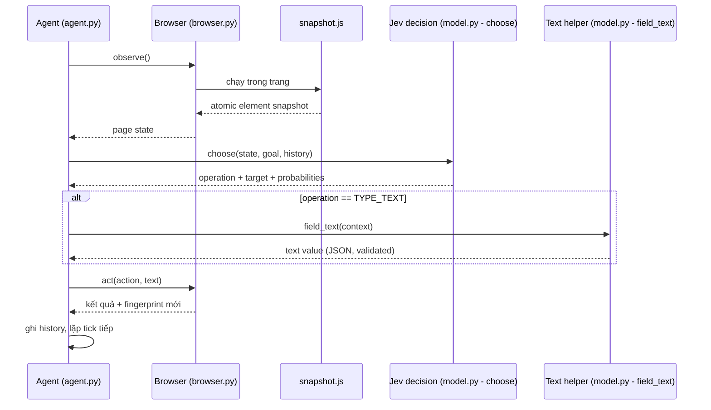
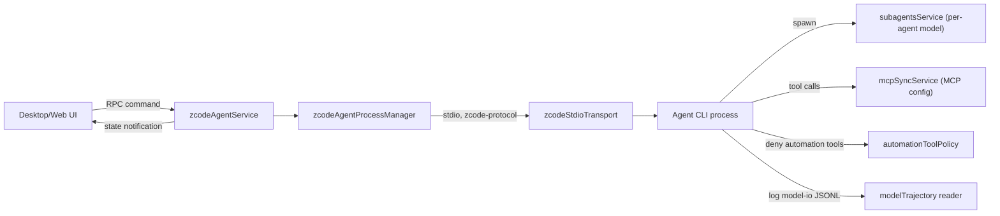
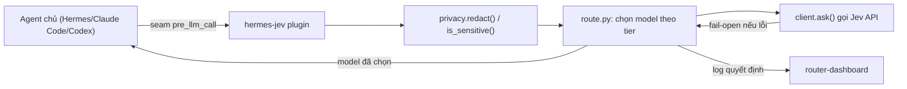
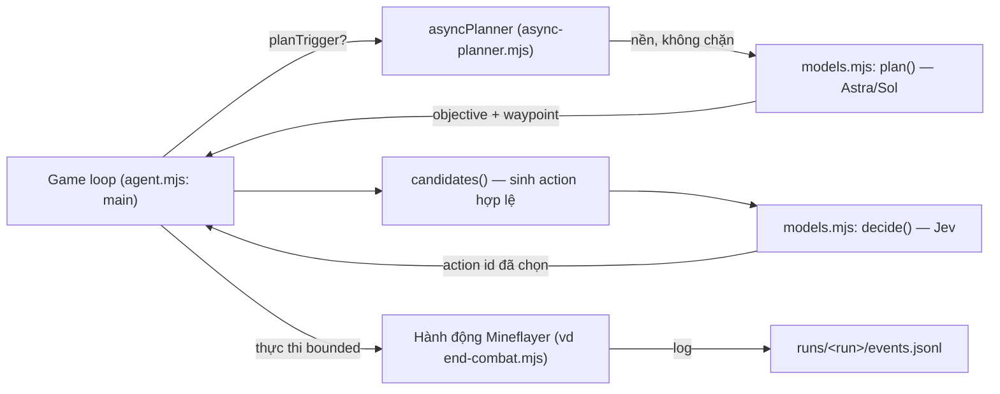

# Weekly Agentic-AI Scan — 2026-09-22

Phạm vi: repo agentic-AI mới publish hoặc update đáng kể trong 7 ngày qua (từ 2026-09-15), được chọn qua GitHub search API, WebSearch, và đọc trực tiếp source code (không chỉ README).

## Tóm tắt điều hành

- Tuần này nổi lên một cụm sản phẩm dùng chung **TypeSafe's Jev** — một "decision model" giá rẻ (~0.4s, dưới $0.0001/lần gọi) chỉ trả lời câu hỏi dạng choice/score/yes-no chứ không sinh văn bản; hai trong bốn repo được chọn (`jev-ultrafast`, `minecraft-agent`) dùng Jev làm bộ điều khiển hành động bounded, còn `hermes-jev-skills` là bộ công cụ tổng quát hoá chính pattern đó (routing, memory-filter, compaction) cho agent bất kỳ.
- `jev-ultrafast` (browser-use org, 16.4k sao) đáng chú ý nhất về kỹ thuật: gộp hai quyết định (operation + target) vào **một** network round-trip bằng dynamic action-space theo index, giảm browser protocol calls từ 1.092 xuống 101 trong benchmark nội bộ — một ví dụ production engineering thực chất, có số đo, có test offline.
- `ZCode` (zai-org, 5.9k sao) là coding-agent harness monorepo dạng Host↔Agent qua stdio protocol có typed schema, có guardrail denylist cho automation tool và model-trajectory logging per-session — nhưng governance/architecture thật sự nằm ở `apps/zcode-cli` mà repo chỉ public phần vỏ (Desktop/Web/services), nên phần lõi loop của agent không đọc được trực tiếp.

## Mục lục

- [browser-use/jev-ultrafast](#jev-ultrafast)
- [zai-org/ZCode](#zcode)
- [kerpopule/hermes-jev-skills](#hermes-jev-skills)
- [rmalde/minecraft-agent](#minecraft-agent)

---

## 1. browser-use/jev-ultrafast

**Link:** https://github.com/browser-use/jev-ultrafast (xác thực nội dung qua `raw.githubusercontent.com`, HTTP 200 trên README, pyproject.toml, và toàn bộ file trong `jev_ultrafast/`; `github.com` bị chặn ở tầng proxy phiên này nên xác thực qua WebFetch — trang tồn tại, hiển thị đủ nội dung, 16.4k sao)

### §1 Quick Context

Browser agent chọn hành động từ bảng phần tử có đánh số thay vì tự sinh selector, để giảm số vòng gọi model. Stack: Python 3.12+, `httpx[http2]`, Chrome qua CDP (thư viện `browser-harness`), Jev (TypeSafe) cho quyết định operation/target, một LLM nhỏ (mặc định `inception/mercury-2.5` qua OpenRouter, hoặc `deepseek-chat`) chỉ để sinh text khi cần gõ. Repo health: 16.4k sao, 1.0k fork, MIT, chỉ 3 commit trên main (squashed release), **không có `.github/workflows`** — test chạy offline bằng `uv run pytest` nhưng không có CI tự động, là một lỗ hổng đáng lưu ý.

### §2 Architecture Deep-Dive

**A. Component inventory**
- `Agent` (`jev_ultrafast/agent.py`) — command-loop chính (`tick`/`predict`/`act`), giữ state trong một dict Python thuần, quản lý vòng đời một phiên duyệt web.
- `Browser` (`jev_ultrafast/browser.py`) — kết nối CDP tới Chrome qua `browser-harness`, chạy `snapshot.js` để đọc DOM, thực thi click/type/select, kiểm tra "freshness" của trang trước khi hành động.
- `snapshot.js` (`jev_ultrafast/snapshot.js`) — script JS chạy trong trang để chụp atomic snapshot các control đang hiển thị, giữ tham chiếu node DOM thật (không dùng selector).
- Jev decision client (`jev_ultrafast/model.py`, hàm `choose()`) — gọi `POST https://api.typesafe.ai/v1/systemone`, hỏi đồng thời câu "operation nào" và (nếu áp dụng) "target nào", validate xác suất trả về (`validate_choice`).
- Text helper (`jev_ultrafast/model.py`, hàm `field_text()`) — LLM nhỏ, chỉ được gọi khi operation là `TYPE_TEXT`, bắt buộc trả JSON `{"text": ...}`.
- Instruction templates (`jev_ultrafast/questions.py`) — prompt cố định cho operation/target/text, cấm mọi câu lệnh trình duyệt hay code trong output.
- `Demo`/Inspector (`jev_ultrafast/demo.py`) — local web UI ở `127.0.0.1:8766` hiển thị xác suất từng bước.

**B. Control flow pattern**: đây là biến thể ReAct rút gọn thành **một bước quan sát → một request quyết định → một hành động** (không có reasoning/thought text hiển thị, quyết định là index/enum, không phải câu). Happy path:
1. `Agent.__init__` mở trang, gọi `Browser.observe()` lấy snapshot phần tử đầu tiên.
2. `command("tick")` gọi `predict`: `Browser.observe()` refresh nếu trang không "fresh", rồi `model.choose()` hỏi Jev — trả về `operation` (CLICK/TYPE_TEXT/SELECT/WAIT/DONE/BLOCKED) và `target` trong cùng một request.
3. Nếu `TYPE_TEXT`, gọi `field_text()` với LLM nhỏ để sinh giá trị field, dùng `pending_text` cache để tránh sinh lại nếu request bị lặp do stale page.
4. `command("act")`: verify fingerprint trang chưa đổi kể từ lúc quyết định, resolve `target` về node DOM thật, thực thi qua `Browser.act`.
5. Ghi lại quyết định (probabilities, confidence, latency) vào `history`, refresh snapshot mới.
6. Lặp lại tới khi Jev chọn `DONE` (yêu cầu double-check trang chưa đổi) hoặc `BLOCKED`, hoặc chạm `MAX_STEPS` (60).

**C. State & data flow**: state là một dict Python in-memory duy nhất trong `Agent.state` (`browser`, `goal`, `page`, `history`, `decisions`…) — không có persistence, không DB. Message giữa Agent và Jev là JSON có schema cố định (`elements`, `recent_actions` giới hạn 10 turn gần nhất, `questions` dict theo operation). Không có context-window management phức tạp — window quản lý bằng cách chỉ gửi 10 hành động gần nhất và text hiển thị (không gửi offscreen text).

**D. Tool/capability integration**: "tool" duy nhất là chính trình duyệt, không phải qua function-calling kiểu OpenAI — model chỉ trả một `choice` (index) trong bảng đã liệt kê sẵn ("chỉ có thể chọn ID được cung cấp"). Validation nghiêm ngặt trong `validate_choice`/`_check_answer`-style: kiểm tra `choice` nằm trong tập hợp lệ, tổng xác suất ≈1, mọi số trong [0,1]. Sandbox: model output *không bao giờ* trở thành selector, coordinate hay JS thực thi — executor luôn resolve lại từ node DOM đã quan sát và re-check occlusion/freshness trước khi click.

**E. Memory**: không có — mỗi phiên là stateless ngoài `history` trong RAM của session hiện tại (không xác định cơ chế long-term từ code).

**F. Model orchestration**: phân vai rõ ràng — Jev (decision model, rẻ, nhanh) chọn operation+target; LLM nhỏ riêng biệt (đổi được qua `TEXT_MODEL`/`TEXT_MODEL_BASE_URL`) chỉ sinh chuỗi text khi cần gõ field. Không có model lớn "planner" nào khác — không phân cấp planner/executor, chỉ có decision/generation tách biệt theo tác vụ.

**G. Observability & eval**: không dùng OpenTelemetry/Langfuse; log thủ công per-step (`operation_probabilities`, `confidence`, `latency_ms`, `usage`) lưu trong `history`/`decisions`. Có eval log riêng (`docs/performance.md`) với con số đo được: 6 lần chạy lặp lại, median 9.450s → 7.092s (giảm 25%), 1.092 → 101 protocol call. Test offline bằng `pytest` + `node --check` cho JS, nhưng không có CI workflow chạy tự động.

**H. Extension points**: dùng thư viện qua `Agent(url, goal)` — đổi được task tự do; đổi text-model qua biến môi trường; thêm ví dụ mới trong `examples/`. Không có cơ chế plugin tool chính thức (đây là MVP nhỏ, không phải framework mở rộng).

### §3 Architecture Diagram

### §4 Verdict

Điểm mới thực sự: gộp "chọn operation" và "chọn target" vào **cùng một** HTTP request bằng cách hỏi song song nhiều câu hỏi (mỗi operation có "target head" riêng) rồi chỉ dùng câu trả lời khớp với operation đã chọn — kỹ thuật speculative fan-out cho phép giảm round-trip mà vẫn giữ tính đúng đắn (target head không dùng bị bỏ qua). Đây không phải "dùng LLM chọn nút bấm" thông thường mà là thiết kế action-space có cấu trúc, validate chặt server-side.

Red flag: không có CI, chỉ 3 commit (squashed release, khó đánh giá lịch sử phát triển thật), benchmark chỉ 3 lần lặp trên 1 task/1 browser profile (tác giả tự thừa nhận "not a general reliability benchmark"), phụ thuộc hoàn toàn vào một API độc quyền (`api.typesafe.ai`) chưa rõ SLA công khai. Câu hỏi mở: hiệu năng có giữ được trên trang phức tạp hơn Google Flights (SPA nặng, shadow DOM — chính README nói chưa hỗ trợ) hay không.

---

## 2. zai-org/ZCode

**Link:** https://github.com/zai-org/ZCode (xác thực qua `raw.githubusercontent.com` HTTP 200 cho README.md, DESIGN.md, AGENTS.md, package.json, và các file TypeScript trong `packages/services/src/`; `github.com` bị chặn proxy, xác thực thay thế qua WebFetch — 5.9k sao)

### §1 Quick Context

Coding-agent workspace dạng monorepo: desktop app (Electron), web client, và Agent CLI giao tiếp qua giao thức nội bộ có type. Stack: TypeScript/Node 24, React + Zustand, Electron, pnpm workspace/Turbo, RPC framework riêng (`@zcode/rpc`). Repo health: 5.9k sao, 1.7k fork, Apache-2.0, chỉ 2 commit hiển thị (squashed public release) — **không thấy `.github/workflows`**, nhưng có `pnpm verify:pre-push` (typecheck + lint + "architecture check") chạy local trước khi push.

### §2 Architecture Deep-Dive

**A. Component inventory**
- Agent Service (`packages/services/src/zcode-agent/zcodeAgentService.ts`) — lớp service phía Host bọc quanh tiến trình Agent, expose qua RPC descriptor (`zcodeAgent.ts` khai báo kiểu, không chứa loop logic).
- Stdio Transport (`packages/services/src/zcode-agent/zcodeStdioTransport.ts`) — kênh giao tiếp Desktop main ↔ Agent CLI qua stdio.
- Protocol Client (`packages/services/src/zcode-agent/zcodeProtocolClient.ts`) — client nói giao thức `zcode-protocol` (có versioning v4, typed message theo `packages/shared/src/zcode-protocol/index.ts` theo AGENTS.md).
- Process Manager (`packages/services/src/zcode-agent/zcodeAgentProcessManager.ts`) — quản lý vòng đời tiến trình Agent.
- Subagents Service (`packages/services/src/subagents/subagentsService.ts`, `subagentModelSelection.ts`) — tạo/quản lý subagent, mỗi subagent có `ModelSelection` (providerId/modelId/reasoningLevel) riêng, validate bằng zod schema (`modelSelectionSchema.parse`).
- MCP Sync Service (`packages/services/src/mcp-sync/mcpSyncService.ts`) — đồng bộ cấu hình MCP server giữa `.zcode/cli/config.json` và `.agents/mcp.json`.
- Automation Tool Policy (`packages/services/src/zcode-agent/automationToolPolicy.ts`) — denylist tool cho các vòng automation (deny `CronCreate/Update/Delete` để tránh tự-đệ-quy tạo lịch vô hạn; riêng vòng off-peak deny `OffPeakCreate`).
- Model Trajectory Reader (`packages/services/src/zcode-agent/modelTrajectory.ts`) — đọc file `model-io-<sessionId>.jsonl` để dựng lại lịch sử gọi model của một task/session.

**B. Control flow pattern**: **state machine / event-driven IPC**, không phải ReAct loop lộ ra ở tầng repo public (agent loop thật nằm trong `apps/zcode-cli`, chỉ có mô tả trong AGENTS.md, không đọc được source runtime trực tiếp từ các link đã thử). Happy path (dựa trên AGENTS.md + service code):
1. Desktop/Web UI gửi lệnh qua RPC (`ServiceChannels`) tới `zcodeAgentService`.
2. `CommandInbox` (mô tả trong AGENTS.md) serialize các input busy/running theo thứ tự nhận (admission control), Renderer chỉ giữ optimistic draft.
3. `zcodeAgentProcessManager` spawn/route tới tiến trình Agent CLI qua `zcodeStdioTransport`, theo giao thức `zcode-protocol`.
4. Agent CLI chạy vòng lặp thật (không public trong repo này), có thể spawn subagent qua `subagentsService` với model riêng.
5. Mọi lệnh gọi model được ghi vào `model-io-*.jsonl`; `modelTrajectory.ts` đọc lại để hiển thị trace trong UI.
6. State cập nhật broadcast ngược lên UI qua `ZCodeStateUpdatedNotification` (typed event trong RPC).

**C. State & data flow**: message là **typed schema** (TypeScript interface + zod validation, ví dụ `modelSelectionSchema.parse`), không phải string/dict tự do — đây là điểm khác biệt rõ so với 3 repo còn lại. State lưu trữ: model-trajectory dưới dạng file JSONL trên đĩa (`~/.zcode/cli/{debug,rollout}/model-io-*.jsonl`), giới hạn trả về mặc định 200 record gần nhất (`DEFAULT_TRAJECTORY_LIMIT`) để tránh "long session làm sập UI". Không xác định context-window management (sliding/summarize) từ các file đã đọc được — không có bằng chứng trực tiếp.

**D. Tool/capability integration**: tool đăng ký qua **MCP** (Model Context Protocol) — `mcpSyncService.ts` đọc/ghi cấu hình MCP server từ hai nguồn (`.zcode/cli/config.json` khoá `mcp.servers`, và `.agents/mcp.json` khoá `mcpServers`), cho thấy ZCode tương thích chuẩn `.agents` chung của hệ sinh thái. Guardrail: `automationToolPolicy.ts` là một denylist tường minh, có comment giải thích lý do (chặn đệ quy tự tạo cron job) — bằng chứng engineering thật, không phải trang trí.

**E. Memory**: có thư mục `packages/services/src/memory` (thấy trong directory listing) nhưng không đọc được nội dung file cụ thể trong phiên này — không xác định chi tiết cơ chế (ngắn hạn/dài hạn, retrieval) từ code đã đọc.

**F. Model orchestration**: **per-subagent model selection** — mỗi subagent có thể được gán provider/model/reasoning-level riêng qua `ModelSelection`, chuẩn hoá bằng `normalizeSubagentModelSelection()`. Không xác định từ code cụ thể model nào giữ vai trò "planner" cấp cao nhất (nằm trong `apps/zcode-cli`, không public đọc được).

**G. Observability & eval**: có cơ chế trace riêng — model-trajectory JSONL theo session, không dùng OpenTelemetry/Langfuse chuẩn công nghiệp mà tự xây (`createServiceLogger(scope)` với 4 level debug/info/warn/error, quy định rõ debug không log ở production). Không xác định replay/eval-hook tự động từ code đã đọc (có `pnpm architecture:check` nhưng đó là kiểm tra dependency-graph, không phải eval của agent).

**H. Extension points**: thêm MCP server qua file cấu hình chuẩn (`.agents/mcp.json`) — không cần sửa code; thêm subagent với model tuỳ chọn qua `subagentsService`; UI mở rộng qua `packages/ui/src/components/ui/` theo `DESIGN.md`.

### §3 Architecture Diagram

### §4 Verdict

Điểm đáng học: dùng **typed RPC protocol có versioning (v4)** thay vì message string/dict tự do giữa UI và Agent process — hiếm thấy ở repo agent mã nguồn mở (đa số dùng JSON lỏng lẻo); và denylist tool tường minh có comment giải thích lý do kỹ thuật cụ thể (chống tự-đệ-quy cron) chứ không phải guardrail hình thức.

Red flag lớn nhất: đây là **coding-agent harness mà phần lõi (agent loop, planner, ReAct logic) nằm trong `apps/zcode-cli` không đọc được qua các link public đã thử** — repo public chủ yếu là lớp UI/Desktop/service-orchestration bọc quanh một agent runtime "hộp đen". Vì vậy nhiều mục ở §2 (memory chi tiết, control-flow bên trong Agent, model nào làm planner) buộc phải ghi "không xác định từ code". Câu hỏi mở: liệu `apps/zcode-cli` có thật sự open-source đầy đủ hay chỉ build script trỏ tới binary/package riêng.

---

## 3. kerpopule/hermes-jev-skills

**Link:** https://github.com/kerpopule/hermes-jev-skills (xác thực qua `raw.githubusercontent.com` HTTP 200 cho README.md và toàn bộ file trong `jevkit/`; `github.com` bị chặn proxy, xác thực thay thế qua WebFetch — 402 sao, có CI `test.yml`)

### §1 Quick Context

Bộ công cụ "bộ não phụ" giá rẻ giúp agent (Hermes, Claude Code, Codex) đẩy các quyết định không cần sinh văn bản (routing, lọc memory, chọn turn nào giữ lại...) sang một decision model rẻ và nhanh thay vì tốn token model đắt. Stack: Python 3.9+, chỉ dùng thư viện chuẩn (0 dependency), gọi TypeSafe Jev API và OpenRouter Decisions API. Repo health: 402 sao, 36 fork, MIT, **có CI** (`.github/workflows/test.yml`), test chạy offline hoàn toàn (mọi Jev reply được fake).

### §2 Architecture Deep-Dive

**A. Component inventory**
- Jev Client (`jevkit/client.py`, hàm `ask()`) — HTTP client nghiêm ngặt tới `api.typesafe.ai/v1/systemone` (hoặc OpenRouter Decisions API); validate schema câu trả lời (`choice`/`score`/`noul`), chặn redirect (chống lộ bearer token), retry có giới hạn cho lỗi tạm thời.
- Privacy/Redaction layer (`jevkit/privacy.py`) — `redact()` và `is_sensitive()`: regex nhận diện secret key, credit card (kiểm tra Luhn), email, số điện thoại quốc tế, chuỗi high-entropy — là "biên giới outbound" bắt buộc mọi request phải đi qua trước khi rời máy.
- Router (`jevkit/route.py`) — chọn model rẻ nhất "đủ tốt" cho lượt hiện tại, dựa trên 3 câu hỏi Jev trả lời (độ khó, loại việc, rủi ro), map ra model theo `tiers`/`SPECIALTIES`; có danh sách từ khoá rủi ro (`_HARD_RISK`) không bao giờ được route xuống tier rẻ nhất.
- Compactor (`jevkit/compact.py`) — chọn turn nào giữ khi phải cắt transcript, đo được recall thực tế (xem `evals/compaction/results/SCORECARD-2026-09-20.md`).
- Search loop (`jevkit/search.py`) — Jev chỉ chọn kết quả nào đáng mở và có đủ bằng chứng chưa, chưa bao giờ tự viết query.
- Hermes plugin (`hermes/plugin/hermes-jev/__init__.py`, `plugin.yaml`) — móc vào Hermes qua seam công khai (`pre_llm_call`, middleware `llm_request`, tool, slash command), không patch core Hermes.
- CLI (`jevkit/cli.py`) — entrypoint lệnh `jev` (routing shadow/on, dashboard, mail...).

**B. Control flow pattern**: **event-driven / hook-based middleware** — đây không phải bản thân một agent loop mà là lớp chặn (interceptor) gắn vào vòng đời gọi LLM của agent chủ (Hermes/Claude Code/Codex) qua các "seam" công khai. Happy path (ví dụ routing một lượt chat):
1. Agent chủ chuẩn bị gọi LLM cho lượt hiện tại → seam `pre_llm_call` được kích hoạt.
2. Plugin gọi `route.py`, redact nội dung qua `privacy.redact()`, cắt còn tối đa `ask_chars` (2500 ký tự, chủ yếu đầu+cuối).
3. `client.ask()` gửi state + 3 câu hỏi (choice độ khó, choice loại việc, noul rủi ro) tới Jev trong **một** request.
4. Code (không phải Jev) map kết quả sang model cụ thể trong pool theo tier/specialty, áp luôn rule an toàn cứng (risk word → không xuống tier rẻ).
5. Nếu Jev lỗi/timeout/low-confidence → fail-open, giữ nguyên model đang dùng, không bao giờ chặn lượt chat.
6. Log quyết định (tier, model, confidence, latency — **không** log prompt) hiển thị real-time trên `router-dashboard`.

**C. State & data flow**: message tới Jev là **typed question dict** (`{"type": "choice"/"score"/"noul", "instructions": ..., "criteria": ...}`), có validator riêng ở cả client lẫn caller. Không có state storage tập trung — cấu hình routing lưu file JSON (`~/.hermes/jev/routing.json`, override theo profile). "Context window management" ở đây chính là sản phẩm cốt lõi: `compact.py` là chiến lược chọn-giữ-turn dựa trên điểm số Jev (không phải summarize bằng LLM), đã đo được 71 turn chọn trong 0.95s, thắng "chọn theo recency" 11/15 câu hỏi test.

**D. Tool/capability integration**: agent chủ nhận 5 tool mới: `jev_memory_filter`, `jev_compact_select`, `jev_choose_action`, `jev_supervise`, `jev_escalate` — đăng ký qua plugin seam, không phải function-calling gốc của LLM lớn (Jev không phải LLM sinh text, nó là service riêng được gọi qua HTTP, kết quả được *dùng làm* input cho quyết định của agent chủ). Validation output rất chặt: mọi xác suất phải hợp lệ [0,1], `choice` phải nằm trong tập đã liệt kê, sai định dạng → raise `JevError` thay vì đoán.

**E. Memory architecture**: có — nhưng vai trò của Jev chỉ là **bộ lọc/ranker** cho memory retrieval đã có sẵn (không tự làm retrieval): với mỗi passage lấy về, Jev trả lời "đáng đọc không" và "có chứa chỉ thị ẩn không" (injection screen chạy local kể cả khi Jev down). Không xác định cơ chế vector/keyword retrieval gốc từ code đã đọc (đó là phần của agent chủ, không thuộc repo này) — chỉ xác định được lớp lọc phía sau retrieval.

**F. Model orchestration**: mô hình đảo ngược so với pattern thường thấy — thay vì "model lớn lập kế hoạch, model nhỏ thực thi", ở đây **model rẻ (Jev) ra quyết định định tuyến/lọc, model đắt chỉ làm phần sinh văn bản**. README nêu rõ từng theo dõi chi phí: mailbox sorting ~$0.00002/tin, triage ~$0.00006/tin.

**G. Observability & eval**: dashboard riêng (`jev dashboard`, `router-dashboard/`) hiển thị quyết định real-time (tier, work kind, model, pool, confidence, latency). Có "shadow mode" (`/jev routing shadow`) — quyết định và log nhưng không switch, dùng để đánh giá trước khi bật thật. Eval có thể tái chạy trên traffic thật (`evals/compaction`, có scorecard ngày cụ thể).

**H. Extension points**: skill là file `SKILL.md` chuẩn, hoạt động được trên bất kỳ agent nào đọc được skill file (không khoá vào Hermes) — đây là điểm mở rộng chính. Routing pool cấu hình qua JSON, sửa tay hoặc `jev models suggest --write`.

### §3 Architecture Diagram

### §4 Verdict

Điểm mới thực sự và cụ thể: **đo được** rằng handoff/compaction viết từ digest tóm tắt của Jev (keep/summarize/drop) cho recall *thấp hơn* so với gửi nguyên transcript (37.5%→58.7% khi chỉ dùng transcript gốc, theo scorecard) — và nhóm tác giả **đảo ngược quyết định thiết kế ban đầu** dựa trên số đo thay vì giữ nguyên ý tưởng ban đầu. Đây là dấu hiệu hiếm của kỷ luật eval thật, không phải marketing. Lớp `privacy.py` cũng đáng học: comment giải thích từng false-negative đã sửa (ví dụ mã tracking UPS bị nhầm là số điện thoại) cho thấy redaction được vá dựa trên lỗi thật, không viết một lần rồi bỏ.

Red flag: phụ thuộc hoàn toàn vào một API độc quyền chưa rõ độ ổn định lâu dài (`api.typesafe.ai`); toàn bộ "evidence" về độ chính xác nằm trong chính repo, chưa có bên thứ ba kiểm chứng độc lập. Câu hỏi mở: threshold `min_confidence`/`sticky_context_tokens` có tổng quát hoá tốt ngoài fleet nội bộ của tác giả không.

---

## 4. rmalde/minecraft-agent

**Link:** https://github.com/rmalde/minecraft-agent (xác thực qua `raw.githubusercontent.com` HTTP 200 cho README.md, agent.mjs, async-planner.mjs, models.mjs; `github.com` bị chặn proxy, xác thực thay thế qua WebFetch — 486 sao, không có `.github`)

### §1 Quick Context

Agent chơi Minecraft Survival tốc độ (speedrun giết Ender Dragon) bằng hai model: một model lớn lập kế hoạch, Jev chọn hành động cụ thể mỗi tick. Stack: Node.js (ESM `.mjs`), Mineflayer + mineflayer-pathfinder, OpenRouter (GPT-6 "Astra"/GPT-5.6 "Sol" cho planner, `typesafe/jev-1.13` cho action-choice), Java sensor riêng đọc vị trí dragon (read-only). Repo health: 486 sao, 46 fork, cá nhân (không phải org), **không có CI/`.github`**, test chạy thủ công qua `node --test`.

### §2 Architecture Deep-Dive

**A. Component inventory**
- Game loop / Executor (`agent.mjs`) — vòng lặp chính: sinh `candidates()`, gọi `decide()`, thực thi hành động, ghi log, lặp lại.
- Async Planner wrapper (`async-planner.mjs`, hàm `asyncPlanner()`) — chạy planner nền không chặn vòng lặp hành động, tự huỷ kết quả nếu game-stage đã đổi trong lúc chờ.
- Model relay/client (`models.mjs`) — hàm `plan()` gọi planner model (chat completions), hàm `decide()` gọi Jev (`/api/alpha/decisions`) với action list làm `criteria` của một câu hỏi `choice`.
- Model relay transport (`model-relay.mjs`) — proxy gọi model qua relay cục bộ hoặc lấy key trực tiếp từ Google Secret Manager, có retry cho lỗi tạm thời.
- Candidate generator (hàm `candidates()` trong `agent.mjs`) — sinh động danh sách hành động hợp lệ hiện tại (di chuyển, đào, chế tạo, chiến đấu…) dựa trên state game + kế hoạch hiện tại.
- Navigation/Policy modules (`optimization/policy.mjs`, tham chiếu trong `agent.mjs`: `reachedWaypoint`, `planTrigger`, `stageFor`, `selectUsefulOptions`) — logic quyết định khi nào cần lập lại kế hoạch và lọc bớt action thừa.
- Combat module (`end-combat.mjs`) — một hành động chiến đấu bounded (đặt giường, ngắm, kích nổ) mà Jev chọn khi đủ điều kiện.
- Dragon sensor (`observer/DragonObserver.java`) — cảm biến read-only phía server, không sửa game state.

**B. Control flow pattern**: **planner-executor phân tầng bất đồng bộ (hierarchical, 2 tốc độ)** — planner chạy nền chậm (model lớn, ~vài giây, không chặn), executor chạy nhanh mỗi tick (Jev, ~0.4-2s) chọn 1 trong các hành động hợp lệ hiện có. Happy path:
1. Vòng lặp chính (`main()` trong `agent.mjs`) tính `stageFor()` và kiểm tra `planTrigger()` xem có cần lập kế hoạch mới không (dựa trên: đổi dimension, tới waypoint, gặp lỗi liên tiếp, hết action hữu ích).
2. Nếu cần, `asyncPlanner.refresh()` gọi `plan()` trong nền (không `await` chặn action loop trừ khi chưa có plan nào hoặc vừa "arrived").
3. `candidates()` sinh danh sách hành động hợp lệ hiện tại từ state game + `currentPlan.waypoint`/`targets`.
4. `decide()` gửi state đã nén (`compactObservation`) + toàn bộ candidate làm `criteria` cho một câu hỏi `choice` duy nhất tới Jev.
5. Executor chạy hàm hành động được chọn (`selected.fn()`), có timeout bounded (`bounded()`, mặc định 20-25s), ghi kết quả + log JSONL.
6. Khi planner nền xong, `onPlan` cập nhật `currentPlan`; nếu game-stage đã đổi giữa chừng, kết quả bị huỷ (`plan_discarded`) thay vì áp dụng nhầm ngữ cảnh cũ.

**C. State & data flow**: state là object JS in-memory (biến closure trong `agent.mjs`), được nén qua `compactObservation()` trước khi gửi cho model (cắt bớt entity xa, giữ 5 hành động gần nhất, bỏ field không cần) — đây là chiến lược quản lý context kiểu "windowing/summarize thủ công theo rule", không phải RAG. Persistence: mỗi run ghi `runs/<run>/events.jsonl` (append-only log mọi quyết định/kết quả) và `runs/<run>/status.json` (checkpoint để resume). Message tới Jev: JSON string trong field `state`, câu hỏi dạng `{"type": "choice", "criteria": {...}}` giống hệt pattern của `jev-ultrafast` (cùng hệ sinh thái Jev).

**D. Tool/capability integration**: "tool" là các hành động Mineflayer (di chuyển, đào, chế tạo, tấn công…), đăng ký động mỗi tick qua `candidates()` — model không tự sinh code/lệnh, chỉ chọn 1 id trong danh sách offered (`Object.hasOwn(criteria, answer.choice)` kiểm tra chặt, throw `Invalid JEV action` nếu sai). Guardrail cứng viết bằng code, không nhờ model: ví dụ chặn hành động nhảy dài vào cổng End vì có thể mang theo fall damage (ghi rõ trong README là quyết định bị "rejected" sau khi test).

**E. Memory**: không xác định từ code — không có bộ nhớ dài hạn/retrieval; "trí nhớ" duy nhất là `currentPlan` (kế hoạch hiện tại) và `last`/`recent` (20 hành động gần nhất) truyền lại cho cả planner lẫn executor mỗi lượt.

**F. Model orchestration**: phân vai rõ theo tốc độ/chi phí — planner (GPT-6 Astra mặc định, đổi qua `PLANNER_MODEL`) ra mục tiêu cấp cao + waypoint, chạy bất đồng bộ để không chặn game loop; Jev (`typesafe/jev-1.13`) chọn hành động bounded mỗi tick, đồng bộ và nằm trên đường găng của vòng lặp chính. Không có fallback model nếu planner lỗi (chỉ log `plan_error` và giữ plan cũ); không có batching/parallelism giữa nhiều agent (đây là single-agent).

**G. Observability & eval**: log JSONL chi tiết từng quyết định (`request`, `response`, `latencyMs`, `selected`) và từng kết quả hành động — đủ để replay lại một run. `verify-run.mjs` kiểm tra bằng chứng chiến thắng (dragon-kill advancement + exit-portal event + video). Test tự động: `node --test evidence.test.mjs native-mirror.test.mjs optimization/*.test.mjs` — kiểm tra logic (policy, evidence-parsing), không kiểm tra gameplay thật (cần live server). Không có CI chạy tự động các test này.

**H. Extension points**: thêm hành động mới qua `extraActions()` hook (gọi trong `candidates()`); đổi model planner qua env var; route/seed cấu hình trong `optimization/nether/config.json`, `optimization/seed-route.json`.

### §3 Architecture Diagram

### §4 Verdict

Điểm mới cụ thể: tách rõ hai *tốc độ* quyết định trong cùng một agent — planner chạy nền, tự huỷ nếu ngữ cảnh đã đổi trong lúc chờ (`asyncPlanner`, chỉ 19 dòng nhưng xử lý đúng race condition: "if getState().stage !== state.stage, discard") — một pattern nhỏ nhưng đúng đắn, đáng học cho bất kỳ agent nào có tác vụ lập kế hoạch chậm chạy song song hành động nhanh. Việc dùng cùng decision-model "Jev" như `jev-ultrafast` (bounded choice, structured state, không screenshot) cho thấy đây là một pattern lặp lại có chủ đích trong hệ sinh thái TypeSafe, không phải trùng hợp.

Red flag: đây là demo cá nhân cho một tác vụ hẹp (Minecraft speedrun), không phải framework tái sử dụng — nhiều logic hard-code theo đúng seed/route cụ thể (toạ độ cứng trong code). Credentials lấy qua `gcloud secrets` gắn với project GCP cá nhân của tác giả, không tổng quát hoá được. Không có CI, benchmark là 1 lần chạy được quay video, không phải thống kê nhiều lần.

---

*Tổng số repo khảo sát trong vòng discovery: khoảng 15-20 candidate từ GitHub search (created/pushed trong 7 ngày, agent/multi-agent/agentic, >200-500 sao) cộng với WebSearch bổ sung. Loại khỏi danh sách: các "awesome-*" list (`AbdelStark/awesome-typesafe-jev`, `wuyoscar/jev-skill`), các repo quá hẹp/thiếu source đọc được ở mức sâu trong thời gian cho phép (`itsmostafa/typesafe-mcp`, `kitze/skillbox`, `coldteadotai/abide`, `Oldcircle/geo-sleuth`, `fhshaik/typesafe-mario`).*
