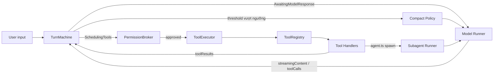
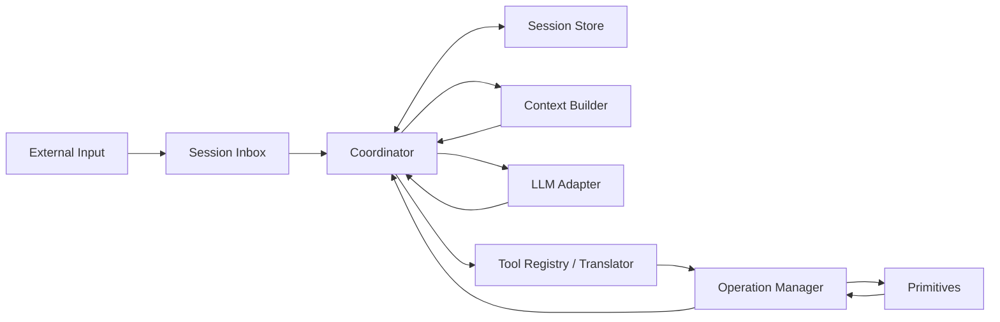
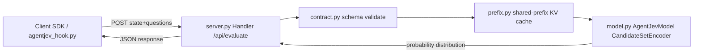
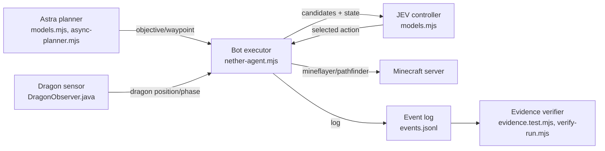

# Weekly Agentic AI Scan — 2026-09-24

**Phạm vi:** repos GitHub thuộc chủ đề agent/multi-agent/agentic, được tạo mới hoặc cập nhật đáng kể trong 7 ngày qua (17/09–24/09/2026), lọc theo evidence kiến trúc thực tế trong code (không dựa trên README/marketing).

## Executive Summary

- Chủ đề nổi bật trong tuần là **tách "hai tốc độ nhận thức"**: một LLM lớn dùng cho planning tần suất thấp, kết hợp với **Jev** — model quyết định nhỏ (0.6B, "System One") trả về xác suất calibrated trong ~50ms để thay thế LLM call cho các quyết định tần suất cao (chọn action, gate tool call). Pattern này xuất hiện độc lập ở 2 repo khác nhau (`agent-jev`, `minecraft-agent`).
- Các coding-agent harness mới (`ZCode`, `unreal-agent`) đều chọn **state machine/actor model tường minh** thay vì vòng lặp ReAct ẩn — ưu tiên khả năng trace, test và mở rộng tool bất đồng bộ (async), phản ánh xu hướng "agent framework" đang trưởng thành về mặt kỹ thuật phần mềm hơn là chỉ prompt engineering.
- Điểm chung cần lưu ý: tất cả 4 repo đều rất mới (3–4 ngày tuổi tại thời điểm khảo sát), nhiều số liệu hiệu năng chỉ tự báo cáo trong README chưa được kiểm chứng độc lập, và không repo nào có CI workflow công khai xác nhận được.

## Mục lục

1. [zai-org/ZCode](#zai-orgzcode)
2. [unreallabsai/unreal-agent](#unreallabsaiunreal-agent)
3. [malevrigns/agent-jev](#malevrignsagent-jev)
4. [rmalde/minecraft-agent](#rmaldeminecraft-agent)

---

## zai-org/ZCode

### §1 — Quick Context
Coding agent harness đa nền tảng (CLI/TUI, desktop, web) của Z.ai, hợp nhất agent runtime, tool-calling và workflow động trong một monorepo. Tech stack: TypeScript monorepo (pnpm 10 + Turbo); model layer dùng Vercel AI SDK (`ai@6.0.193` + `@ai-sdk/anthropic`, `@ai-sdk/openai`, `@ai-sdk/openai-compatible`) và `@modelcontextprotocol/client` cho MCP; `zod` validate tool schema; Electron cho desktop; gói `telemetry` riêng xuất trace qua OTLP. Repo health: 6.6k sao, 2.0k fork, Apache-2.0, tạo 2026-09-20 (rất mới); không tìm thấy `.github/workflows` công khai (404) nên không xác định có CI hay không, dù `package.json` có script `verify:pre-push`, `typecheck`, `architecture:check` cho thấy gate nội bộ.

### §2 — Architecture Deep-dive

**A. Component inventory**
- `TurnMachine` (`apps/zcode-cli/packages/core/src/agent/turn-machine.ts`) — state machine điều khiển một turn hội thoại.
- `ToolRegistry` (`.../core/src/tool/registry.ts`) — đăng ký tool theo tên canonical + alias, chống trùng/xung đột permission.
- `ToolExecutor` (`.../core/src/tool/executor.ts`) — thực thi tool đã lên lịch.
- `PermissionBroker` (`.../core/src/permission/broker.ts`) — gate quyền trước khi chạy tool.
- Tool handlers (`.../core/src/tool/handlers/`) — `bash.ts`, `read.ts`, `edit.ts`, `agent.ts` (spawn subagent), `skill.ts`, `*-workflow*.ts`.
- `Model Runner` (`.../packages/adapters/src/model/runner.ts` + `runner-retry.ts`, `failure-classifier.ts`) — gọi model qua Vercel AI SDK, có retry/failure-classification.
- `Subagent Runner` (`.../core/src/subagent/runner.ts`) — chạy sub-agent với tool/model riêng.
- `Compact Policy` (`.../core/src/compact/policy.ts`) — quyết định autocompact context.
- `Memory Agent Loop` (`.../core/src/memory/memory-agent-loop.ts`) — loop riêng ghi/đọc memory dự án, giới hạn tool.
- `Telemetry/OTLP Exporter` (`.../packages/telemetry/src/otlp-exporter.ts`).
- `Workflow Expert/Scheduler` (`.../core/src/workflow/expert.ts`, `scheduler.ts`).

**B. Control flow — ReAct-style state machine.** `turn-machine.ts` định nghĩa enum `Phase`: `ProcessingInput → AwaitingModelResponse → Streaming → (SchedulingTools|Completing) → AwaitingPermission → ExecutingTools → AggregatingResults → (loop về AwaitingModelResponse | Completing) → Error`. Happy path: (1) input vào `ProcessingInput`; (2) gọi model qua Model Runner; (3) có `toolCalls` → `SchedulingTools`; (4) qua `PermissionBroker` rồi `ToolExecutor` chạy handler (`ExecutingTools`); (5) `AggregatingResults` gộp kết quả, quay lại (2); (6) `toolCalls.length === 0` và có `streamingContent` → `Completing`.

**C. State & data flow.** Message dạng `ModelMessage` lưu trong session history; autocompact tham số hoá rõ: `DEFAULT_COMPACT_CONTEXT_WINDOW=200_000`, buffer `13_000` token, output reserve `32_000`, summary tối đa `20_000`, circuit breaker `MAX_CONSECUTIVE_AUTOCOMPACT_FAILURES=3`.

**D. Tool integration.** Native function-calling qua Vercel AI SDK với schema `zod`; mở rộng qua MCP (`@modelcontextprotocol/client`). Không thấy sandbox container/VM thật — kiểm soát chủ yếu bằng policy string-matching (`bash-readonly-policy`, `path-policy.ts`).

**E. Memory architecture.** Hai lớp: short-term = message history + autocompact/summarization; long-term = `Memory Agent Loop` riêng biệt (tool-set giới hạn: Read/Grep/Glob/readonly-Bash/Edit/Write) ghi file memory dự án. Có module `recall/` nhưng cơ chế retrieval cụ thể (vector/embedding hay chỉ liệt kê file) không xác định từ code đã đọc.

**F. Model orchestration.** Provider abstraction qua `@ai-sdk/anthropic`/`openai`/`openai-compatible`, nhưng file `provider/index.ts` rỗng (`export {}`) nên chưa xác nhận logic chọn provider thực tế nằm ở đâu. Có retry/fallback rõ ràng (`retry-policy.ts`, `retry-budget.ts`, `offpeak-retry.ts`). Subagent có `profile-model-selection.ts` để chọn model khác theo profile.

**G. Observability & eval.** Gói `telemetry` riêng: OTLP exporter, `agent-trace-runtime`, `agent-metrics.ts`, `model-api-recorder.ts`, `error-sanitizer.ts` (che dữ liệu nhạy cảm trước khi log).

**H. Extension points.** `.agents/skills/` (skill có `SKILL.md`), plugin packages (`superpowers-plugin`, `browser-use-plugin`), MCP cho tool ngoài, marketplace plugin riêng `zai-org/zcode-plugins`.

### §3 — Architecture Diagram

### §4 — Verdict
Đáng học: `turn-machine.ts` là state machine tường minh thay vì vòng lặp while ẩn — dễ trace/test hơn ReAct loop thông thường; autocompact tham số hoá chi tiết (buffer, reserve, circuit-breaker chống lặp compact fail) hiếm thấy công khai; tách hẳn "Memory Agent Loop" chạy tool-set giới hạn nghiêm ngặt để ghi memory; hệ "workflow expert/scheduler" gợi ý orchestration đa-agent dạng workflow-graph do người dùng định nghĩa. Red flags: `provider/index.ts` rỗng dù khai đủ dependency provider; không thấy `.github/workflows` công khai; repo tạo 4 ngày trước khi đạt 6.6k sao — tốc độ tăng sao bất thường; không có sandbox thật cho bash tool. Cần đào sâu: `workflow/scheduler.ts` để xác nhận parallelism thật; nội dung `memory/recall/` (embedding hay không); cách provider Zhipu/GLM thực sự wire vào.

---

## unreallabsai/unreal-agent

### §1 — Quick Context
Thư viện Go điều phối agent bất đồng bộ, tách rời LLM turn khỏi thực thi tool qua actor model và channel. Stack: Go 1.27, dependency ngoài tối giản (`oapi-codegen/runtime`, `golang.org/x/image`, `google/uuid`) — tự viết client cho OpenAI, OpenAI Codex, OpenRouter, Fireworks, Ollama. Repo health: ~1.8k sao, MIT license, tạo 21/09/2026, có CI (`ci.yml`) chạy `make test check build` trên ubuntu-24.04 + macos-15, job fuzzing riêng (4 fuzz targets), job Harbor benchmark (Python/uv + Docker).

### §2 — Architecture Deep-dive

**A. Component inventory**
- `Coordinator` (`harness/coordinator/coordinator.go`, `loop.go`) — vòng lặp quyết định của một session.
- `Session Inbox` (`harness/inbox/inbox.go`) — dedupe input bên ngoài/control/crash trong bộ nhớ.
- `Session Store` (`harness/sessionstore/sessionstore.go`, `localfile/`) — lịch sử append-only, fork/phục hồi được.
- `Context Builder` (`harness/contextbuilder/builder.go`, `skills.go`) — dựng model input, trả kèm bản ghi phần bị lược/nén.
- `LLM Adapter` (`harness/llm/adapter.go`, `model.go`) — interface `Respond(ctx, Request, RequestOptions)`.
- `Tool Registry` + `Translator` (`harness/tool/registry.go`, `tool.go`) — đăng ký tool tĩnh (Bash, ViewImage) + skill động qua `RegisterSkill`.
- `Operation Manager` (`harness/operation/local_manager.go`, `remote_job.go`) — actor runtime thực thi operation bất đồng bộ, worker pool.
- `Primitives` (`harness/primitives/{compute,file,process,remote,sse,timer}.go`) — đơn vị thực thi cấp thấp.

**B. Control flow — event-driven coordinator loop.** 1) Input ngoài → dedupe ở Session Inbox → Coordinator ghi vào Session Store; 2) Context Builder dựng model input từ lịch sử session; 3) Coordinator gọi `LLM.Respond()` trong goroutine riêng, kết quả về qua channel trong khi `select` chính vẫn phục vụ inbox/operation updates/heartbeat; 4) tool_call → Translator (đồng bộ, không I/O) sinh `Operation`; 5) Operation Manager (actor 1 goroutine, 4 loại channel) dispatch Primitive tương ứng chạy song song; 6) Coordinator dịch kết quả thành `ToolResult`, nối vào session, lặp lại tới khi `Response.Stop`.

**C. State & data flow.** Message: `Item{ProviderID,Type,Data}` bọc `Message`, `ToolCall`, `ToolResult`. State lưu Session append-only, fork được, backend `localfile`. Context Builder trả kèm record phần bị lược/nén nhưng thuật toán nén cụ thể không xác định từ code đã đọc.

**D. Tool/capability integration.** Native function-calling qua `Tool{Type,Name,Description,Parameters}`; Translator parse+validate tường minh trước khi tạo Operation. Không tìm thấy bằng chứng sandbox container/seccomp cho Bash tool — không xác định từ code.

**E. Memory architecture.** Không có memory dài hạn/retrieval — không xác định từ code; chỉ có session history append-only, fork được.

**F. Model orchestration.** `Adapter` interface đơn giản, không thấy retry/fallback ở tầng interface (chưa xác minh ở từng client). Điểm "async-first" nằm ở: LLM call chạy goroutine riêng; Operation Manager actor 1-goroutine dùng 4 loại channel; remote job handler dùng worker pool; Coordinator gom batch input tới 100 item/1ms, grace period 1s sau model response.

**G. Observability & eval.** Không tìm thấy "opentelemetry"/"otel" trong code. Có eval hook dạng benchmark: job Harbor trong CI và fuzz testing gốc (4 fuzz targets) — đây là eval/regression, không phải observability runtime.

**H. Extension points.** README nêu rõ mọi interface (Adapter, Registry, Operation Manager, Session Store) đều thay thế được, ví dụ "proxy operations manager" gửi operation serialize tới remote sandbox. Item/Operation đều versioned/serializable.

### §3 — Architecture Diagram

### §4 — Verdict
Đáng học: tách bạch rõ "Translator" (đồng bộ, không I/O, chỉ validate+submit) khỏi "Operation" (bất đồng bộ, actor/primitive) — giải quyết đúng vấn đề "model bị block chờ tool" mà nhiều framework khác né bằng polling thô; Operation Manager theo actor pattern (1 goroutine sở hữu state, giao tiếp qua channel) là thiết kế Go idiomatic tránh race; Operation versioned + serializable hỗ trợ remote sandbox proxy. Red flags: không có observability/tracing chuẩn dù đã public benchmark; không có memory/retrieval dài hạn; thuật toán compact context chưa kiểm chứng nội dung thực; repo rất mới (3 ngày tuổi khi đạt 1.8k sao). Cần đào sâu: nội dung `contextbuilder/builder.go` (thuật toán cắt/nén), retry/fallback thực sự nằm ở đâu, mức độ sandbox thật của Bash tool.

---

## malevrigns/agent-jev

### §1 — Quick Context
Model quyết định 0.6B tham số, không sinh token, trả về phân phối xác suất calibrated cho câu hỏi Boolean/Choice/Score dựa trên state phi cấu trúc (diff/log/trace). Stack: Python, PyTorch + HuggingFace Transformers, backbone Qwen3-0.6B với candidate-scoring head tự viết; serving qua HTTP thuần (`http.server`), không dùng FastAPI/gRPC/ONNX. Repo tạo 2026-09-21, ~281 sao, hoạt động dồn dập 3 ngày, có nhiều file test nhưng không có `.github/workflows` (không CI), Apache-2.0.

### §2 — Architecture Deep-dive

**A. Component inventory**
- `AgentJevModel`/`CandidateSetEncoder`/`ScalarScorer` (`agentjev/model.py`) — backbone Qwen3-0.6B (bỏ LM head) + head chấm điểm candidate permutation-equivariant.
- `DecisionEngine`/`server.py` (`jev_service/server.py`) — HTTP server (`ThreadingHTTPServer`), route `POST /api/evaluate`.
- Schema/question parser (`jev_service/contract.py`) — định nghĩa 3 loại câu hỏi Boolean/Choice/Score, validate input.
- Shared-prefix runtime (`jev_service/prefix.py`) — `common_prefix()`/`encode()` cache KV cho phần state+question chung giữa các candidate.
- Client SDK (`agentjev_client.py`) — class `AgentJev` với `decide_boolean/decide_choice/score`.
- Tool-gating hook (`agentjev_hook.py`) — PreToolUse hook cho Claude Code, chặn Bash/Write/Edit rủi ro cao.
- Routing/aux classifier (`agentjev/routing.py`) — phân loại hành động agent (read/search/edit/test/finish/delegate).
- Eval harness (`typed_decisions/evaluate_laya.py`, `summarize.py`) — so sánh với baseline "Laya".

**B. Control flow (state+question → xác suất calibrated), 6 bước:** 1) Client/hook gửi JSON `{state, questions[]}` tới `agentjev_client.evaluate()`; 2) HTTP POST `/api/evaluate` → validate size; 3) `contract.py` parse & validate từng câu hỏi, sinh candidate path; 4) `prefix.py` nhóm path theo prefix chung, encode 1 lần, cache KV rồi mở rộng suffix theo batch; 5) `model.py` chấm điểm độc lập từng candidate → logits → softmax (temperature scaling); 6) Server trả JSON phân phối xác suất + giá trị suy ra theo loại câu hỏi.

**C. State & data flow.** Input state là dict/list/string phi cấu trúc; output là phân phối xác suất JSON. Không có state lưu trữ bền vững ở server (stateless); hook ghi log cục bộ có timestamp/confidence.

**D. Tool/capability integration.** HTTP JSON API (client SDK mặc định port `8149`, còn `server.py` argparse mặc định `18765` — hai default không khớp). Tích hợp chủ yếu qua Python SDK hoặc hook Claude Code (fail-open khi service không phản hồi).

**E. Memory architecture.** Không có — hệ thống stateless theo request.

**F. Model orchestration.** Base Qwen3-0.6B, không có bằng chứng quantization. Latency công bố: ~50-70ms/case (5 câu hỏi/state); 298.91ms cho 64 lựa chọn nhờ shared-prefix caching (giảm 92.4% compute) so với 500-600ms baseline. Vai trò: bộ lọc/gate song song với LLM lớn, fallback fail-open.

**G. Observability & eval.** `typed_decisions/` có eval so với baseline "Laya" trên 2.000 câu hỏi (400 case), báo cáo accuracy, soft cross-entropy, Brier sum, ECE 10-bins, score expectation MAE (đọc từ report.json có sẵn — code tính metric gốc không xác định được). `protocol.json` mô tả split dev/calibration/test và temperature scaling theo checkpoint selection.

**H. Extension points.** `train.py` cấu hình qua YAML, hỗ trợ `init_from` checkpoint (phase-1→phase-2), layer-wise LR decay 5 nhóm. Thêm câu hỏi Boolean/Choice/Score mới không cần train lại; tùy biến domain mới cần fine-tune qua `train.py` + dữ liệu tự chuẩn bị.

### §3 — Architecture Diagram

### §4 — Verdict
Đáng học: "candidate-scoring head" permutation-equivariant thay LM head — chấm điểm song song mọi candidate thay vì decode tuần tự; shared-prefix KV caching cho câu hỏi nhiều lựa chọn (giảm 92.4% compute, sai lệch xác suất <0.0005) là kỹ thuật cụ thể; kỷ luật eval có dev/calibration/test split tách bạch, báo cáo ECE/Brier thay vì chỉ accuracy. Red flags: default port giữa client (8149) và server (18765) không khớp; không có CI; repo chỉ 3 ngày tuổi, dường như một tác giả; code tính calibration metric gốc chưa xác định được vị trí. Câu hỏi mở: checkpoint HuggingFace (`aimeigaoshou/agent-jev`) có tái lập được số liệu benchmark không; baseline "Laya" là gì/của ai chưa rõ từ code đã đọc.

---

## rmalde/minecraft-agent

### §1 — Quick Context
Bot Minecraft tự chơi, dùng LLM lập kế hoạch cấp cao + model quyết định nhanh để điều khiển từng hành động, có ghi hình gốc và xác minh route bằng bằng chứng game state. Stack: Node.js ESM, Mineflayer + mineflayer-pathfinder, prismarine-viewer, canvas; model planner (`openai/gpt-6-astra`/`gpt-5.6-sol`) qua OpenRouter chat-completions, model controller (`typesafe/jev-1.13`) qua endpoint `/api/alpha/decisions`. Repo 533 sao, 52 fork, tạo 20/09/2026, branch main chỉ 1 commit (có thể đã squash trước public). Có test qua `node --test`; không thấy CI workflow công khai.

### §2 — Architecture Deep-dive

**A. Component inventory**
- `Astra planner` (`models.mjs`, `async-planner.mjs`) — LLM lập kế hoạch: objective, item target, waypoint, chạy nền bất đồng bộ (~15s/lần hoặc khi đổi stage).
- `JEV controller` (`models.mjs`, gọi trong `nether-agent.mjs`) — model quyết định nhanh, chọn 1 action từ tập candidate hợp lệ dựa trên state hiện tại.
- `Bot/action executor` (`nether-agent.mjs`) — vòng lặp chính dùng Mineflayer + pathfinder, hàm `candidates()`, `state()`.
- `Combat module` (`end-combat.mjs`) — action đánh giường (bed attack) có giới hạn, hủy nếu mất cover.
- `Dragon sensor` (`observer/DragonObserver.java`) — sensor Java chỉ-đọc, expose vị trí/phase đầu rồng qua HTTP local.
- `Native recording/mirror` (`native-mirror.mjs`, `native-client/`) — mirror protocol sang client Minecraft thật để quay video xác thực.
- `Evidence/route verifier` (`evidence.test.mjs`, `verify-run.mjs`) — kiểm tra ≥2 tín hiệu độc lập (kill advancement, `win_game`, dragon health/phase) tránh false positive.
- `Event log` (`events.jsonl`, `status.json`, `victory.json`) — log request/response/action/kết quả.

**B. Control flow — planner-executor phân cấp, planner chạy async tách rời controller:** 1) Bot khởi tạo qua Mineflayer, kết nối server local; 2) Astra chạy nền, nhận `compactObservation(state)`, trả objective/waypoint; 3) vòng lặp chính sinh `candidates()` theo stage (prepare/entry/nether/stronghold/combat/exit); 4) JEV `decide(state(), candidates)` chọn 1 action; 5) action thực thi qua Mineflayer/pathfinder (timeout 25s), sensor DragonObserver cấp dữ liệu khi combat; 6) kết quả log vào `events.jsonl`, lặp lại tới khi evidence-checker xác nhận victory.

**C. State & data flow.** Schema `state()` chung (vị trí, inventory, độ bền công cụ, dimension, stage, dragon observation) là message format giữa planner/controller; `compactObservation()` cắt gọn trước khi gửi model. Trạng thái bền vững lưu file (`status.json`, `events.jsonl`, `victory.json`). Nếu stage đổi giữa lúc Astra đang plan, kết quả bị discard.

**D. Tool/capability integration.** Mineflayer là lớp giao tiếp protocol Minecraft; action set bounded/enumerated (travel, mine 1 block, collect drop, craft, open chest, eat, sleep, combat), không phải free-form. JEV chọn qua typed-decision endpoint riêng, không generate text/code.

**E. Memory architecture.** "Native recording" là cơ chế ghi hình xác thực (mirror protocol để capture video), không phải bộ nhớ cho quyết định. Việc Astra tự sinh "skill" mới qua các lần chạy (đề cập trên bài đăng X của tác giả) không xác minh được trong code đã đọc.

**F. Model orchestration.** Planner = LLM tần suất thấp, chi phí cao (~$0.96/run theo README); Controller = JEV, tần suất cao, chi phí rất thấp (~$0.01/run, 131 quyết định). Hai model gọi qua 2 API khác nhau trên cùng OpenRouter. Không thấy fallback model tự động trong code — chỉ đổi qua env var `PLANNER_MODEL`.

**G. Observability & eval.** `evidence.test.mjs` kiểm tra 3 điều kiện độc lập; `verify-run.mjs` đối chiếu video/log; test chạy qua `node --test`. Số liệu "17 run checks, 29 local tests passed" tự báo cáo trong README, chưa tự chạy để xác minh.

**H. Extension points.** Đổi model qua `PLANNER_MODEL` env var; route cố định trong `optimization/nether/config.json`; `combat-lab/` là server test riêng để phát triển code combat mới trước khi đưa vào agent chính.

### §3 — Architecture Diagram

### §4 — Verdict
Đáng học: tách rõ 2 "tốc độ nhận thức" — planner LLM async, chi phí cao, tần suất thấp vs. controller JEV typed-decision rẻ/nhanh cho quyết định real-time; cơ chế evidence-verification đòi hỏi ≥2 tín hiệu độc lập chống false-positive khi tự báo cáo thắng; tách sensor chỉ-đọc khỏi action layer để không "gian lận" state. Red flags: repo rất mới (4 ngày tuổi), main chỉ 1 commit (có thể đã squash); không CI; số liệu hiệu năng chỉ tự báo cáo trong README; credentials qua Google Secret Manager riêng của tác giả gây khó tái lập. Cần đào sâu: cơ chế Astra tự sinh skill mới có thực sự trong code hay chỉ mô tả ngoài lề; JEV (`typesafe/jev-1.13`) là black-box bên thứ ba, không rõ kiến trúc/calibration nội bộ.
