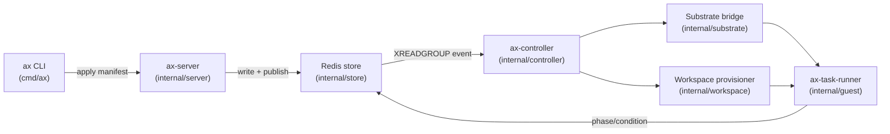
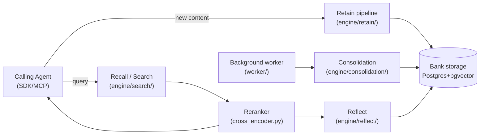
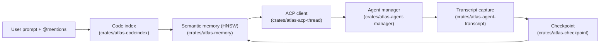

# Weekly Agentic-AI Repo Scan — 2026-09-25

Phạm vi: repo agentic-AI được tạo mới hoặc cập nhật đáng kể trong khoảng 2026-09-18 → 2026-09-25, có sao đủ lớn (>200 nếu mới, >500 nếu cập nhật), đã được đọc trực tiếp README/cấu trúc thư mục/mã nguồn (không suy đoán).

## Tóm tắt điều hành

- Tuần này chọn được 3 repo đạt tiêu chí, đại diện cho 3 lớp bài toán khác nhau của hệ sinh thái agentic: **điều phối hạ tầng cho hàng loạt agent** (`google/ax`), **bộ nhớ dài hạn cho agent** (`vectorize-io/hindsight`), và **source control/audit trail cho phiên làm việc của coding agent** (`pacifio/atlas`) — cả ba đều có commit thực trong đúng cửa sổ 7 ngày (18–25/9/2026).
- `google/ax` và `vectorize-io/hindsight` là hai case đáng chú ý nhất về mặt kỹ thuật: `ax` từ bỏ Kubernetes CRD/etcd để dùng Redis Streams làm control plane thuần event-driven; `hindsight` có eval harness riêng (`hindsight-system-evals`) tích hợp benchmark LongMemEval và một replay tool để debug chất lượng tổng hợp bộ nhớ — hiếm thấy ở các repo "memory for agents" khác.
- `pacifio/atlas` là case thú vị nhưng rủi ro hơn: bản thân nó không phải một "agent" mà là lớp giám sát/đóng gói phiên làm việc quanh Claude Code/Codex qua ACP — giá trị nằm ở checkpoint/audit trail hơn là ở kiến trúc suy luận.

## Mục lục

1. [google/ax](#google-ax)
2. [vectorize-io/hindsight](#vectorize-io-hindsight)
3. [pacifio/atlas](#pacifio-atlas)
4. [Self-check](#self-check)

---

## google/ax

Repo: https://github.com/google/ax

### §1 Quick Context

Bộ điều phối agent khai báo (declarative) của Google, chạy hàng loạt agent workload cô lập trên Kubernetes bằng manifest YAML. Stack: Go, Kubernetes, gRPC, Redis, Protocol Buffers, Docker/`ko`. Sức khỏe repo: 10.7k sao, 519 fork, 632+ commit; có `.github/workflows/` (CI) và `types_test.go`; commit gần nhất trong dữ liệu thu thập được là 25/09/2026, bao gồm một thay đổi kiến trúc lớn ngày 20/09/2026 ("Restructure AX into a general-purpose orchestration layer for agentic tasks").

### §2 Architecture Deep-Dive

**A. Component inventory**
- CLI (`cmd/ax`) — CLI phong cách `kubectl` phát lệnh `apply/get/describe/watch/delete/suspend/resume/ssh/tunnel`.
- API server (`cmd/ax-server`, logic tại `internal/server`) — gRPC service `ax.v1alpha1.AX` (định nghĩa tại `pkg/apis/v1alpha1/ax.proto`, `ax_grpc.pb.go`), stateless, validate manifest rồi ghi Redis và publish event.
- Controller (`cmd/ax-controller`, `internal/controller`) — worker reconciliation, subscribe Redis Streams bằng `XREADGROUP`, điều khiển vòng đời Task/Workspace/Model.
- Task runner (`cmd/ax-task-runner`, `internal/guest`) — entrypoint container trong sandbox, khởi tạo workspace, phục vụ metadata, chạy lệnh agent thật sự.
- Store (`internal/store`) — lớp lưu trạng thái trên Redis (task hash, event stream, pub/sub) — chủ đích thay thế Kubernetes CRD/etcd.
- Substrate bridge (`internal/substrate`) — giao tiếp với "Agent Substrate" bên ngoài để cấp phát actor sandbox.
- Workspace provisioner (`internal/workspace`) — nối Git repo, MCP server, skill package vào môi trường agent trước khi chạy.
- Model manager (`internal/model`) — phân giải provider/credential LLM từ Kubernetes Secret.
- Tunnel (`internal/tunnel`) — quản lý kết nối tới cluster, bám theo `kubectx` hiện tại.
- Schema (`pkg/apis/v1alpha1/types.go`) — định nghĩa 3 primitive Task/Workspace/Model dùng chung cho manifest `ax.io/v1alpha1`.

**B. Control flow pattern**: **Event-driven reconciliation (kiểu Kubernetes operator)**, không phải ReAct/planner-executor cho một agent đơn — đây là hệ điều phối hạ tầng cho *nhiều tiến trình agent*, coi mỗi agent là một Task hộp đen.
1. Dev viết manifest YAML (Task+Workspace+Model), chạy `ax apply` (`cmd/ax`).
2. `ax-server` (`internal/server`) validate theo schema `pkg/apis/v1alpha1`, ghi Redis, publish event.
3. `ax-controller` (`internal/controller`) nhận event qua `XREADGROUP` trên Redis Streams.
4. Controller gọi `internal/substrate` để cấp sandbox actor; `internal/workspace` cấu hình sẵn repo/MCP/skill.
5. `ax-task-runner` (`internal/guest`) khởi động trong sandbox, phục vụ metadata, chạy harness agent thật.
6. Trạng thái (phase/condition) ghi lại qua `internal/store`; dev theo dõi bằng `ax get/watch`, hoặc `suspend/resume` để checkpoint.

**C. State & data flow**: Manifest multi-document YAML → chuyển sang cấu trúc protobuf (`ax.proto`) khi truyền qua gRPC. Toàn bộ state nằm trên Redis (task hash + event stream + pub/sub), DESIGN.md nói rõ lý do né CRD/etcd ("pushes etcd past its comfort zone"). AX không quản lý context window của LLM — nó đứng trên một tầng, coi vòng lặp suy luận của agent là tiến trình mờ (opaque) bên trong Task.

**D. Tool/capability integration**: AX không tự định nghĩa function-calling cho LLM; "Workspace" chỉ nối sẵn MCP server và skill package vào môi trường trước khi agent khởi chạy — việc gọi tool thực sự diễn ra bên trong harness chạy trong sandbox, ngoài tầm kiểm soát của control plane AX.

**E. Memory**: Không có — AX là tầng điều phối/lập lịch, không phải runtime agent có bộ nhớ.

**F. Model orchestration**: Primitive `Model` (`internal/model`) khai báo tĩnh provider/credential LLM cho một Task; không thấy bằng chứng routing động, fallback hay batching đa model trong tài liệu đã đọc.

**G. Observability & eval**: `ax get/describe/watch`, health check `GET /healthz` → `200 OK`, cơ chế `suspend/resume` để checkpoint và tạm dừng task. Không tìm thấy eval/benchmark harness riêng (khác với `hindsight`).

**H. Extension points**: Harness agent mới được thêm qua cấu hình Workspace (bất kỳ tiến trình container nào); Model hỗ trợ provider LLM tùy ý qua credential; CLI theo quy ước mở rộng kiểu `kubectl` — không xác định chi tiết plugin mechanism từ tài liệu đã đọc.

### §3 Architecture Diagram

### §4 Verdict

Điểm đáng chú ý cụ thể: (1) từ bỏ Kubernetes CRD/etcd, chọn Redis Streams làm control plane cho agent workload — một quyết định kiến trúc rõ ràng, có lý do ghi trong DESIGN.md, khác hẳn cách các "agent orchestrator" khác vẫn bọc quanh CRD; (2) tách bạch triệt để giữa "lập lịch hạ tầng" (AX) và "suy luận agent" (harness bên trong Task) — AX không biết gì về prompt/tool-call. Hạn chế: repo còn đang tái cấu trúc gấp (đổi API 3 lần trong tuần, vừa bỏ khái niệm "Gateway" ngày 24/9), tài liệu DESIGN.md tự nhận thiếu chi tiết scheduling algorithm và sandboxing. Câu hỏi mở: cơ chế cô lập sandbox thực sự (namespace/gVisor/Firecracker?) và giới hạn thông lượng thực tế ("billions of workloads") chưa có benchmark công khai để kiểm chứng.

---

## vectorize-io/hindsight

Repo: https://github.com/vectorize-io/hindsight

### §1 Quick Context

Hệ thống bộ nhớ dài hạn cho AI agent: trích xuất, hợp nhất và truy hồi tri thức qua nhiều phiên thay vì chỉ replay lịch sử hội thoại. Stack: Python (FastAPI, SQLAlchemy/AsyncPG, pgvector), PostgreSQL/Oracle AI DB, OpenTelemetry + Prometheus, 25+ LLM provider qua LiteLLM. Sức khỏe repo: 28.1k sao, 2.7k fork, 3.179+ commit, release `v0.10.1` ngày 21/09/2026, có 3 thư mục test/eval riêng (`hindsight-system-tests`, `hindsight-integration-tests`, `hindsight-system-evals`) và workflow Release trên CI.

### §2 Architecture Deep-Dive

**A. Component inventory**
- Memory engine (`hindsight-api-slim/hindsight_api/engine/memory_engine.py`) — điều phối trung tâm cho retain/recall/reflect.
- Retain pipeline (`hindsight-api-slim/hindsight_api/engine/retain/`) — dùng LLM trích xuất fact/entity/relationship, chuẩn hóa thành bản ghi canonical.
- Search/Recall (`hindsight-api-slim/hindsight_api/engine/search/`) — truy hồi đa chiến lược: semantic vector, keyword BM25, graph, temporal.
- Reflect (`hindsight-api-slim/hindsight_api/engine/reflect/`) — phân tích sâu, tổng hợp mental model/knowledge page.
- Consolidation (`hindsight-api-slim/hindsight_api/engine/consolidation/`) — hợp nhất/tinh chỉnh observation theo thời gian.
- Reranker (`hindsight-api-slim/hindsight_api/engine/cross_encoder.py`, `jina_mlx_reranker.py`) — rerank sau khi hợp nhất bằng reciprocal rank fusion.
- Entity/graph layer (`entity_resolver.py`, `graph_maintenance.py`, `causal_links.py` cùng thư mục `engine/`) — dựng đồ thị entity/temporal/causal.
- LLM provider abstraction (`hindsight-api-slim/hindsight_api/engine/providers/`) — hỗ trợ 25+ backend LLM.
- MCP server (`hindsight-api-slim/hindsight_api/mcp_local.py`, `mcp_tools.py`) — mỗi memory bank có một MCP endpoint riêng.
- Worker nền (`hindsight-api-slim/hindsight_api/worker/`) — chạy job consolidation/refresh bất đồng bộ.
- Metrics/Tracing (`hindsight-api-slim/hindsight_api/metrics.py`, `tracing.py`) — Prometheus + OpenTelemetry.
- Eval harness (`hindsight-system-evals/`) — bọc AMB (Agent Memory Benchmark) để chạy LongMemEval và các test chất lượng riêng.

**B. Control flow pattern**: Không phải vòng lặp của một agent — Hindsight là **service/pipeline được agent bên ngoài gọi vào** (event/pipeline pattern theo từng memory bank cô lập). Happy path (khi một agent tích hợp Hindsight):
1. Agent gọi Retain gửi nội dung mới vào một Bank (qua SDK/MCP/REST).
2. `engine/retain/` dùng LLM trích fact/entity/relationship, ghi bản ghi canonical + nhiều chỉ mục tìm kiếm (vector, BM25, graph, temporal).
3. Khi có truy vấn, `engine/search/` chạy song song 4 chiến lược, hợp nhất bằng reciprocal rank fusion, rerank bằng `cross_encoder.py`/`jina_mlx_reranker.py`.
4. Kết quả trả về agent làm context, hoặc đưa vào `engine/reflect/` để tổng hợp sâu thành mental model/knowledge page.
5. Worker nền (`worker/`) kích hoạt `engine/consolidation/` bất đồng bộ để hợp nhất/tinh chỉnh observation, cập nhật knowledge page.
6. Webhook (`webhooks/`) bắn sự kiện retain/consolidation/refresh; metrics/tracing ghi latency, token, chi phí mỗi lệnh gọi.

**C. State & data flow**: "Bank" = không gian nhớ cô lập theo user/agent/project, lưu trên Postgres+pgvector (hoặc Oracle AI DB/pg0 nhúng). Chiến lược quản lý context window: Hindsight đóng vai trò bộ nhớ ngoài — agent gọi vào chỉ nhận top-K kết quả đã rerank, không phải toàn bộ lịch sử; "knowledge page" là lớp tóm tắt được refresh dần (test 05 trong `hindsight-system-evals` đo chính chi phí token của việc refresh page này) thay vì replay transcript thô.

**D. Tool/capability integration**: Lộ diện dưới dạng MCP server theo từng bank (`http://localhost:8888/mcp/{bank_id}/`) — model gọi vào qua MCP native tool-calling; ngoài ra có REST API và SDK (Python/Node/Go/CLI) dùng function call tường minh, không parse JSON tự do.

**E. Memory architecture**: Đây chính là kiến trúc bộ nhớ của repo — phân tầng kiểu sinh học: world facts/experiences (ngắn hạn, thô) → observations/mental models (dài hạn, đã consolidate) → knowledge page (tóm tắt sống). Nén/tóm tắt qua Reflect + consolidation job nền; truy hồi qua 4 chiến lược song song + RRF + cross-encoder rerank.

**F. Model orchestration**: Cấu hình được 25+ provider LLM (`HINDSIGHT_API_LLM_PROVIDER`), dùng LiteLLM làm lớp thống nhất; model dùng cho extraction (retain), synthesis (reflect) và reranking là các model/role tách biệt — không xác định chi tiết logic fallback/batching cụ thể từ tài liệu đã đọc.

**G. Observability & eval**: OpenTelemetry tracing + Prometheus metrics (token, latency, số lệnh gọi LLM) tích hợp sẵn; `hindsight-system-evals/` bọc AMB để chạy LongMemEval và các bộ test riêng (độ hội tụ knowledge page, chất lượng câu trả lời reflect, độ trung thực ngôn ngữ khi trích fact, chi phí refresh); có công cụ replay "chạy lại N lần một request delta-ops đã ghi, theo từng biến thể system prompt, rồi chấm điểm document kết quả" — năng lực replay/regression thực sự hiếm gặp ở repo dạng "memory for agent". README tự nhận benchmark được Virginia Tech Sanghani Center và Washington Post tái lập độc lập — đây là tuyên bố từ chính repo, chưa tự kiểm chứng được.

**H. Extension points**: `hindsight-extensions/` cho điểm mở rộng tenant/auth/storage; 60+ tích hợp sẵn (LangGraph, LlamaIndex, CrewAI, AutoGen, n8n, Zapier...); thư mục `skills/` cho skill thủ tục phía agent; chế độ nhúng Python không cần server riêng.

### §3 Architecture Diagram

### §4 Verdict

Điểm đáng chú ý cụ thể: (1) tách retain/recall/reflect thành 3 pipeline độc lập với module riêng biệt trong code (không chỉ là 3 API endpoint đặt tên đẹp); (2) có eval harness thực sự (`hindsight-system-evals`) tích hợp benchmark ngoài (AMB/LongMemEval) cộng công cụ replay để debug chất lượng tổng hợp — mức độ nghiêm túc về eval hiếm thấy ở các "memory layer" khác (kể cả mem0). Hạn chế: phụ thuộc nặng vào Postgres+pgvector nên triển khai không hề "nhẹ" dù tên gọi `hindsight-api-slim`; claim benchmark từ bên thứ ba (Virginia Tech, Washington Post) chỉ nằm trong README, chưa có link paper/report độc lập kiểm chứng được trong lần đọc này. Câu hỏi mở: chi tiết thuật toán entity resolution/graph maintenance và độ chính xác cross-bank isolation khi scale nhiều tenant.

---

## pacifio/atlas

Repo: https://github.com/pacifio/atlas

### §1 Quick Context

Lớp "source control" cho AI coding agent: biến prompt, tool-call và reasoning của agent thành checkpoint gắn liền với commit Git, chạy song song nhiều agent (Claude Code, Codex, agent gốc của Atlas). Stack: Rust (Tauri backend, các crate), TypeScript/React (CodeMirror, Vite), SQLite, chỉ mục vector HNSW cục bộ, Agent Client Protocol (ACP). Sức khỏe repo: 6.2k sao, 311 fork, 1.105+ commit, bản phát hành `alpha-0.3.3` ngày 19/09/2026, commit gần nhất trong dữ liệu thu thập được là 22/09/2026; có CI (`ci.yml`), Clippy/Oxlint, Husky pre-commit hook.

### §2 Architecture Deep-Dive

**A. Component inventory**
- Agent manager (`crates/atlas-agent-manager`) — sinh/quản lý agent ngoài (Claude Code, Codex) dưới dạng subprocess ACP, cộng agent gốc.
- ACP thread client (`crates/atlas-acp-thread`) — hiện thực giao thức Agent Client Protocol để giao tiếp với subprocess agent.
- Agent store (`crates/atlas-agent-store`) — lưu registry/trạng thái các agent.
- Transcript capture (`crates/atlas-agent-transcript`) — ghi lại prompt, tool call, reasoning theo từng phiên.
- Checkpoint (`crates/atlas-checkpoint`) — gắn commit Git về đúng phiên gốc, "patch-id reconciliation" để sống sót qua rewrite lịch sử.
- Git integration (`crates/atlas-git`, `crates/atlas-gitdiff`) — dựng commit graph, xử lý diff.
- Memory/semantic index (`crates/atlas-memory`) — chỉ mục HNSW cục bộ trên plan và thay đổi file, chia sẻ giữa các agent.
- Code index (`crates/atlas-codeindex`) — phân giải @mention thành file/symbol/branch cục bộ.
- Embedding (`crates/atlas-embed`) — sinh embedding phía thiết bị cho semantic match.
- Knowledge base server (`crates/atlas-kb-server`) — phục vụ `.atlas/knowledge/`, `CLAUDE.md`, `AGENTS.md` như một chỉ mục thống nhất.
- Session store (`.atlas/sessions.db`, SQLite, gitignored) — bản ghi phiên cục bộ, secret bị scrub trước khi ghi đĩa.

**B. Control flow pattern**: **Middleware giám sát đa agent / context-injection layer** đứng trước các agent gắn ngoài qua ACP — Atlas không tự chạy một vòng lặp suy luận, nó bọc quanh vòng lặp của agent khác.
1. User soạn prompt có @mention; `atlas-codeindex` phân giải file/symbol/branch cục bộ bằng Rust.
2. `atlas-memory` chạy semantic search HNSW trên thiết bị để lấy context liên quan từ plan/thay đổi file/knowledge trước đó.
3. Context đã gộp + prompt gửi qua ACP (`atlas-acp-thread`) tới agent được chọn — subprocess ngoài (Claude Code/Codex) hoặc agent gốc (fork của Codex engine), do `atlas-agent-manager` quản lý.
4. Agent thực thi; `atlas-agent-transcript` ghi lại prompt, tool call, thay đổi file, reasoning trong lúc chạy.
5. Khi thay đổi được commit, `atlas-checkpoint` gắn commit Git đó về bản ghi phiên gốc trong `.atlas/sessions.db`.
6. Session/knowledge trở thành bộ nhớ có thể truy vấn cho phiên sau (của bất kỳ agent nào), khép vòng quay lại bước 2.

**C. State & data flow**: Dữ liệu phiên → SQLite (`.atlas/sessions.db`), secret bị scrub trước khi ghi đĩa; ghi chú/knowledge → Markdown thuần trong `.atlas/knowledge/` (version hóa cùng Git); canvas → JSON. Chiến lược quản lý context window: thay vì replay toàn bộ lịch sử, Atlas phân giải @mention thành con trỏ nhẹ và chỉ kéo các đoạn bộ nhớ khớp ngữ nghĩa qua HNSW, giữ prompt context nhỏ.

**D. Tool/capability integration**: Agent tích hợp qua ACP (Agent Client Protocol) — giao thức subprocess chuẩn hóa, không phải parse JSON tự chế; agent ngoài chạy như tiến trình hệ điều hành cô lập (không thấy chi tiết sandbox nào sâu hơn process isolation); agent gốc của Atlas là bản fork in-process của Codex engine.

**E. Memory architecture**: Một tầng bộ nhớ chia sẻ trên thiết bị (không thấy tách rõ ngắn hạn/dài hạn) — chỉ mục ngữ nghĩa HNSW trên plan/thay đổi file, cộng với knowledge base markdown có cấu trúc riêng; không tìm thấy pipeline nén/tóm tắt tường minh — không xác định chi tiết cơ chế consolidation từ tài liệu đã đọc.

**F. Model orchestration**: Không xác định từ code — Atlas giao hoàn toàn việc chọn model cho agent bên dưới (Claude Code dùng model riêng, Codex dùng model riêng); không có bằng chứng về lớp routing/fallback đa model do Atlas kiểm soát.

**G. Observability & eval**: Lịch sử checkpoint/session đóng vai trò audit trail, truy vấn được "nhiều tháng sau khi phiên kết thúc"; có CI (`ci.yml`) với Clippy + Oxlint; không tìm thấy eval/benchmark harness riêng (khác hẳn `hindsight`) — không xác định phương pháp eval.

**H. Extension points**: Bất kỳ agent nào hiện thực ACP, hoặc có trong "ACP registry", đều có thể được Atlas tự động sinh ra; nguồn knowledge là file thuần (CLAUDE.md, AGENTS.md, markdown) mà công cụ bất kỳ đều ghi được.

### §3 Architecture Diagram

### §4 Verdict

Điểm đáng chú ý cụ thể: (1) "patch-id reconciliation" để checkpoint sống sót qua rebase/history rewrite — một chi tiết kỹ thuật rất cụ thể, không phải marketing chung chung; (2) coi phiên làm việc của nhiều agent khác nhau (Claude Code, Codex, agent gốc) là dữ liệu version-hóa dùng chung qua ACP, thay vì khóa vào một agent duy nhất. Hạn chế: bản thân Atlas không có kiến trúc suy luận riêng — giá trị "agentic" nằm ở việc bọc quanh agent khác, nên nếu tách phần kiến trúc suy luận ra thì phần còn lại giống một dev-tool quản lý phiên hơn là một "agent" theo nghĩa chặt; đang ở giai đoạn alpha (đổi tên "memory" → "timeline" ngay trong tuần), chưa có eval harness. Câu hỏi mở: cơ chế cô lập bảo mật thực sự cho agent subprocess, và độ tin cậy của patch-id reconciliation khi lịch sử Git bị rewrite phức tạp (squash nhiều lần, force-push).

---

## Self-check

- Link khả kiểm chứng: cả 3 repo đều được `WebFetch` trực tiếp (trang chính, `tree/main`, `raw.githubusercontent.com/.../README.md`, `DESIGN.md`/`pyproject.toml`) và trả về nội dung thật, không có 404. Đạt.
- Không repo nào là awesome-list hay tutorial: cả 3 đều có mã nguồn thực (Go/Python/Rust), nhiều module, hàng nghìn commit. Đạt.
- §2.A: mọi component đều gắn kèm đường dẫn file thật lấy từ `tree/main/...` hoặc `raw.githubusercontent.com`; không có mục nào thiếu path. Đạt.
- §2.B: mỗi repo đặt tên rõ ràng cho control-flow pattern (event-driven reconciliation / pipeline-service theo bank / context-injection middleware đa agent), không dùng thuật ngữ mơ hồ. Đạt.
- §3: cú pháp Mermaid (`flowchart LR`) đã kiểm tra thủ công về dấu ngoặc/mũi tên, hợp lệ cho cả 3 diagram. Đạt.
- §3: mọi node trong diagram đều xuất hiện trong §2.A tương ứng (không thêm thành phần suy đoán). Đạt.
- §4: các điểm "novel" đều cụ thể (Redis Streams thay CRD/etcd; eval harness + replay tool tích hợp AMB/LongMemEval; patch-id reconciliation cho checkpoint) — không dùng câu chung chung kiểu "sử dụng LLM". Đạt.
- Đường dẫn file tuân theo quy ước yêu cầu và là Markdown hợp lệ trên GitHub. Đạt.
