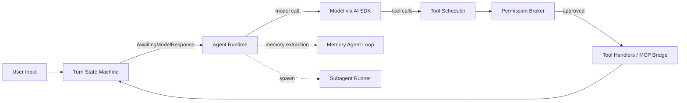
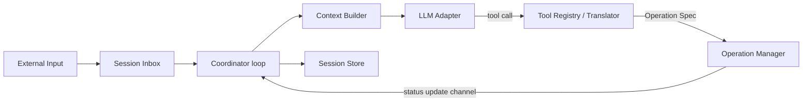
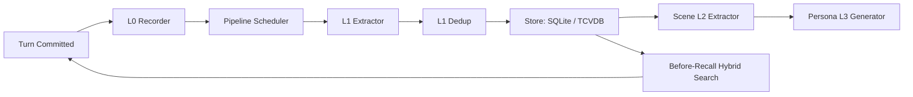
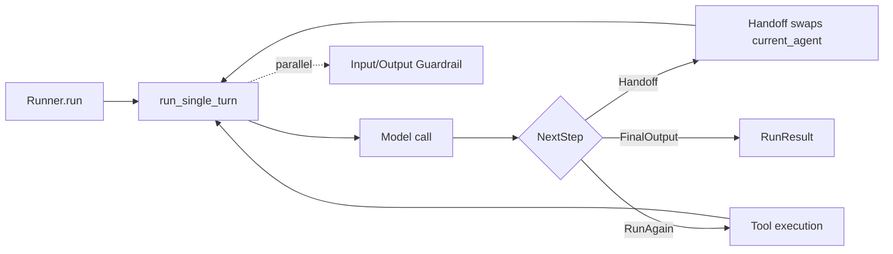

# Weekly Agentic AI Scan — 2026-09-26

**Phạm vi**: repo publish hoặc active đáng kể trong 19–26/09/2026, lọc theo GitHub search API (`created:>2026-09-19 stars:>200`, mở rộng sang `pushed:>2026-09-19 stars:>500`).

## Executive summary

- Tuần này, phần lớn repo *mới tạo* có sao cao trong không gian "agent/agentic" là skill-wrapper mỏng cho Claude Code/Codex, awesome-list hoặc course material — không qua được relevance filter (novel architecture / eval / production engineering). Danh sách cuối cùng gồm 2 agent harness mới ra mắt tuần này (ZCode, unreal-agent) và 2 dự án lớn, có architecture đáng học, vừa active mạnh trong 7 ngày qua (TencentDB-Agent-Memory, openai-agents-python).
- Điểm kỹ thuật đáng chú ý nhất: **ZCode** dùng một typed turn-state machine tường minh cho ReAct loop; **unreal-agent** tách triệt để Tool Translator (đồng bộ, cấm I/O) khỏi Operation Manager (bất đồng bộ) để hỗ trợ remote/sandbox execution; **TencentDB-Agent-Memory** có dedup prompt LLM 4-action (store/skip/update/merge) khá kỷ luật cho memory conflict resolution; **openai-agents-python** biến handoff giữa agent thành "chỉ là một tool call khác" trả về object `Agent`.
- Red flag đáng chú ý nhất: **ZCode** có dấu hiệu là bản export định kỳ từ codebase nội bộ (chỉ 3 commit công khai, không có CI workflow) và có hẳn một subsystem để import session JSONL của Claude Code — nên xem con số "6.8k stars" với dè dặt, đây gần như chắc chắn là fork kiến trúc/derivative của Claude Code chứ không phải thiết kế độc lập.

## Mục lục

1. [zai-org/ZCode](#1-zai-orgzcode)
2. [unreallabsai/unreal-agent](#2-unreallabsaiunreal-agent)
3. [TencentCloud/TencentDB-Agent-Memory](#3-tencentcloudtencentdb-agent-memory)
4. [openai/openai-agents-python](#4-openaiopenai-agents-python)

---

## 1. [zai-org/ZCode](https://github.com/zai-org/ZCode)

### §1 — Quick context

Coding agent harness của Z.ai — desktop/browser/terminal, kiến trúc rất giống Claude Code. Stack: TypeScript/Node.js monorepo (pnpm + Turborepo), Electron desktop, Vercel AI SDK cho model calls, Node built-in `node:sqlite` cho storage. Repo health: ~6.8k stars, ~2.0k forks, Apache-2.0, nhưng **chỉ 3 commit** trong lịch sử public và **không có `.github/workflows`** — không CI/badge nào xác nhận được.

### §2 — Architecture deep-dive

**A. Component inventory**
- `Turn state machine` (`apps/zcode-cli/packages/core/src/agent/turn-machine.ts`) — FSM tường minh cho một turn (Idle→ProcessingInput→AwaitingModelResponse→Streaming→SchedulingTools→ExecutingTools→AggregatingResults→Completing), có transition table hợp lệ.
- `Agent Runtime` (`.../runtime/agent-runtime.ts`) — orchestrator top-level, sở hữu permission broker, tool registry/scheduler, message history, context builder, MCP port, subagent port.
- `Tool Registry` (`.../tool/registry.ts`) — map tool name→handler, alias, project sang `ModelToolContract` gửi cho model.
- `Tool Scheduler` (`.../tool/scheduler.ts`) — topological sort + gom nhóm tool call parallel-safe theo cờ readOnly/destructive/concurrentSafe, max concurrency 10.
- `Permission broker` (`.../permission/broker.ts`) — `DenyPermissionBroker` (fail-closed) và `ManualPermissionBroker` (chờ approval async).
- `MCP bridge` (`.../mcp/index.ts`) — project MCP tool descriptor vào cùng shape `ToolEntry`, có budget cắt kết quả và trust-gate riêng cho MCP "official CUA".
- `Compaction policy` (`.../compact/policy.ts`) — quyết định auto-compact theo ngưỡng token, circuit breaker 3 lần fail liên tiếp.
- `Memory subsystem` (`.../memory/extraction.ts`, `memory-agent-loop.ts`) — sub-agent ReAct loop bị giới hạn tool cực chặt, chỉ đọc/ghi file `.md` trong memory root.
- `Subagent runner` (`.../subagent/runner.ts`, 2142 dòng) — chạy lại đúng loại loop cho subagent được `Agent` tool spawn.

**B. Control flow** — **State-machine-driven ReAct loop** (không phải graph ở top-level; DAG chỉ dùng để parallel hoá tool calls trong một phase). Happy path: (1) Input → `Idle→ProcessingInput`; (2) `AgentRuntime` gọi model → `AwaitingModelResponse`; (3) stream response → `Streaming`; (4) nếu có tool call → `ToolScheduler.schedule()` → `SchedulingTools`; (5) `ExecutingTools`/`AwaitingPermission` qua `permission broker`; (6) `aggregateResults()` → quay lại bước 2 hoặc `Completing`.

**C. State & data flow** — Message là typed schema (`ModelInputMessage` với `role/content/toolCalls/...`), không phải string thô. State turn nằm trong `TurnState`; session/task lưu SQLite (`node:sqlite`) qua `tasksDatabase/`. Context-window quản lý bằng auto-compaction theo ngưỡng token (không có vector store/RAG nào được tìm thấy trong `core/src`).

**D. Tool integration** — Model gọi tool qua native function-calling (Vercel AI SDK, `@ai-sdk/anthropic`/`openai`/`openai-compatible`). Hỗ trợ MCP đầy đủ (`@modelcontextprotocol/client`), namespacing `mcp__<server>__<tool>`. Sandbox ở mức policy, không thấy container/VM: có bash-argv read-only classifier (14 file `bash-readonly-policy-*.ts`), JSON-schema validation, path containment cho memory file.

**E. Memory** — Ngắn hạn: `MessageHistory` + `TurnState`. Dài hạn: **file markdown**, không dùng embeddings — một sub-agent bị giới hạn tool (chỉ Read/Grep/Glob + Write/Edit trên `.md`) tự cập nhật memory file theo manifest kiểu `user/feedback/project/reference`.

**F. Model orchestration** — Model interface đồng nhất (`generateText/streamText/bind`), model selection theo từng subagent profile; auxiliary calls (như memory loop) ép về tier rẻ nhất. Retry: exponential backoff + jitter, 10 lần mặc định. Không có bằng chứng multi-model fallback thực sự (chỉ tên file `official-coding-plan-gateway.ts` gợi ý, chưa xác minh nội dung).

**G. Observability & eval** — OpenTelemetry là first-class dependency (`sdk-trace-base`, `exporter-trace-otlp-proto`...), có `model-api-recorder.ts` ghi lại raw API call. Không tìm thấy eval harness/benchmark suite riêng.

**H. Extension points** — Plugin qua `.zcode-plugin/plugin.json` (skills, MCP servers, slash-commands); subagent custom qua markdown + YAML frontmatter; hooks theo tiến trình riêng (`PreToolUse`, `PermissionRequest`...).

### §3 — Architecture diagram

### §4 — Verdict

Novel/đáng học: typed turn-state machine làm illegal state thành lỗi compile/runtime-catch; bash read-only classifier ở mức argv rất sâu; memory dạng markdown do sub-agent giới hạn tool tự curate (auditable hơn vector DB). Red flag lớn: chỉ 3 commit công khai + không CI → gần như chắc chắn là snapshot định kỳ từ monorepo nội bộ; system prompt của subagent `general-purpose` gần như trùng khớp Claude Code, và có cả subsystem import session JSONL của Claude Code — đây là derivative kiến trúc rõ ràng, không phải "lấy cảm hứng". Câu hỏi mở: `dynamic-workflow-runtime` có phải là control-flow path thay thế thực sự không, hay chỉ là một tool bị gọi từ loop chính?

---

## 2. [unreallabsai/unreal-agent](https://github.com/unreallabsai/unreal-agent)

### §1 — Quick context

"Async-first agent harness" của Unreal Labs, viết bằng Go (+ Python/uv cho benchmark adapter). ~1.9k stars, 103 forks, MIT, 135 commit. CI đầy đủ: `.github/workflows/ci.yml` chạy test/build trên Ubuntu+macOS, có fuzz job và benchmark job Harbor.

### §2 — Architecture deep-dive

**A. Component inventory**
- `Coordinator` (`harness/coordinator/coordinator.go`, `loop.go`) — event loop `select`-based, sở hữu Inbox, Session store, Context Builder, LLM adapter, Tool registry, Operation manager.
- `Session Inbox` (`harness/inbox/inbox.go`) — dedup input theo session, hỗ trợ control mode (StopHard, StopWhenIdle, Heartbeat).
- `Session store` (`harness/sessionstore/sessionstore.go`, impl `localfile/`) — lưu lịch sử append-only, hỗ trợ fork/resume session.
- `Context Builder` (`harness/contextbuilder/builder.go`) — tách "committed" vs "staged" item, chèn placeholder khi tool call đang chạy (đúng chất async).
- `LLM Adapter` (`harness/llm/adapter.go`) — interface `Respond()`, có client cụ thể cho OpenAI/OpenRouter/Fireworks/Ollama, protocol Responses API riêng (`harness/llm/responsesapi/`).
- `Tool Registry` (`harness/tool/registry.go`) — 3 tool built-in (Bash, ViewImage, SkillUse) + discovery skill qua file `SKILL.md`.
- `Operation Manager` (`harness/operation/operation.go`, impl `local_manager.go`) — loop channel-driven riêng, thực thi operation (`Spec` versioned/serializable) độc lập với Coordinator.
- `Primitives` (`harness/primitives/{file,process,timer,compute,sse,remote}.go`) — building block I/O bất đồng bộ mức thấp.

**B. Control flow** — **Event-driven / actor-style async loop**, không phải ReAct đồng bộ cổ điển. Happy path: (1) input vào Inbox, dedup; (2) `processEvents()` gom input/operation update, quyết định gọi model; (3) `requestModelResponse()` build request qua Context Builder rồi **launch goroutine riêng** gọi LLM — Coordinator loop không bị block; (4) model trả tool call → `scheduleToolCall()` tìm `Translator`, validate đồng bộ (cấm I/O), rồi `ctx.Submit(spec)` giao cho Operation Manager; (5) Operation Manager chạy loop riêng, thực thi (vd Bash qua `primitives/process.go`), có thể nhiều operation chạy song song, đẩy update qua channel; (6) `reconcileToolCalls()` chốt trạng thái khi operation Completed/Failed/Canceled, quay lại (2) — nhiều tool call có thể "in-flight" đồng thời.

**C. State & data flow** — Message là Go struct điển hình (`llm.Message{Role,Text,Phase}`, `llm.ToolCall`, `llm.Item`), không phải string thô. Operation payload là envelope versioned/serializable (`operation.Spec{Type,Version,State,Idempotency}`) — chủ đích để một operation manager remote/sandbox có thể chạy thay. Lưu trữ: in-memory cho inbox/context builder staging, durable qua `sessionstore` local-file (`$XDG_STATE_HOME/unreal-agent/sessions`), không có DB backend. Compaction: type `TurnCompaction`/`ChangeKind:"compacted"` tồn tại nhưng thuật toán compaction cụ thể không tìm thấy trong code đã đọc.

**D. Tool integration** — Native function-calling (OpenAI Responses API, `llm.Tool{Name,Description,Parameters}`), không parse JSON từ text tự do. MCP: không thấy trong tree public hiện tại, nhưng có commit "Isolate MCP and add a slim unreal-agent runner" gợi ý MCP đã bị tách ra — chưa xác minh được. Sandbox: Bash tool chỉ validate command (không NUL byte) + scope directory, không có OS-level sandbox trong code Go; container isolation chỉ ở tầng deploy (Dockerfile).

**E. Memory** — Ngắn hạn: lịch sử session append-only, mỗi turn gửi lại toàn bộ context đã commit. Không tìm thấy long-term/retrieval (không vector store, không RAG).

**F. Model orchestration** — Provider chọn qua env var (`UNREAL_HARNESS_LLM_PROVIDER`...), 5 provider có sẵn (Ollama, OpenAI, OpenAI Codex, OpenRouter, Fireworks), một model/provider mỗi run — không có fallback đa-provider hay batching.

**G. Observability & eval** — Không có OpenTelemetry/Langfuse; runner xuất JSONL ra stdout. Điểm mạnh: fuzz test "log matches execution" (`FuzzCoordinatorLogMatchesExecution`, `FuzzRunLogMatchesExecution`) — một dạng replay/trace-verification khá nghiêm túc. Có eval adapter riêng cho Harbor benchmark (`benchmarks/harbor/`).

**H. Extension points** — Tool mới: implement `tool.Translator`. Model mới: implement `llm.Adapter`. Operation execution/sandbox: implement `operation.Manager` — README nói rõ ý định cho phép proxy operation manager gửi sang sandbox remote (nhưng chưa có implementation mẫu trong code public).

### §3 — Architecture diagram

### §4 — Verdict

Điểm novel rõ nhất: tách biệt triệt để giữa Tool Translator (đồng bộ, cấm I/O, chỉ tạo `operation.Spec`) và Operation Manager (bất đồng bộ, thực thi thật) — cho phép thay Operation Manager bằng bản chạy trong sandbox remote mà không đổi code translator. Kỷ luật testing bằng fuzz "log matches execution" hiếm gặp ở agent harness. Red flag: `CONTRIBUTING.md` tự nhận đây là "các component được chọn từ codebase nội bộ lớn hơn" và hiện không nhận PR — tức là bản mở nguồn một phần, không phải dự án cộng đồng thực sự. Câu hỏi mở: MCP support có tồn tại ẩn ở đâu không, và cơ chế compaction thật hoạt động thế nào.

---

## 3. [TencentCloud/TencentDB-Agent-Memory](https://github.com/TencentCloud/TencentDB-Agent-Memory)

### §1 — Quick context

"Team-level memory hub" cho AI agent, biến conversation thành memory asset tái sử dụng. TypeScript/Node ≥22, npm package `@tencentdb-agent-memory/memory-tencentdb` v0.3.6, test bằng vitest. 27.3k stars, 2.6k forks, 831 issue mở, CI có (`pr-ci.yml`).

### §2 — Architecture deep-dive

**A. Component inventory**
- `TdaiCore` (`src/core/tdai-core.ts`) — facade trung tâm, host-neutral, expose `handleBeforeRecall`, `handleTurnCommitted`, `searchMemories`.
- `L0 recorder` (`src/core/conversation/l0-recorder.ts`) — ghi raw message.
- `L1 extractor` (`src/core/record/l1-extractor.ts` + prompt `prompts/l1-extraction.ts`) — 1 LLM call vừa segment scene vừa extract memory có cấu trúc.
- `L1 dedup` (`src/core/record/l1-dedup.ts` + prompt `prompts/l1-dedup.ts`) — batch LLM conflict resolution: store/skip/update/merge.
- `Scene (L2) extractor` (`src/core/scene/scene-extractor.ts`) — nhóm memory L1 mới thành scene block markdown.
- `Persona (L3) generator` (`src/core/persona/persona-generator.ts`, trigger `persona-trigger.ts`) — LLM viết lại `persona.md` theo 5 mức priority trigger.
- `Store abstraction` (`src/core/store/types.ts` interface `IMemoryStore`, impl `sqlite.ts` và `tcvdb.ts` — Tencent Cloud VectorDB thật).
- `Offload subsystem` (`src/offload/`, đặc biệt `pipelines/l2-mermaid.ts`) — short-term "symbolic memory": nén log dài thành Mermaid canvas, truy xuất lại theo `node_id`.
- `Gateway` (`src/gateway/server.ts`) — HTTP REST cho host ngoài (Hermes), auth Bearer tùy chọn.

**B. Control flow** — Pipeline nhiều tầng L0→L1→L2→L3, kích hoạt bởi scheduler, không phải ReAct loop của agent chính. Happy path: (1) turn kết thúc → `handleTurnCommitted` ghi L0; (2) pipeline scheduler trigger L1 extraction sau N round hoặc idle timeout; (3) `l1-extractor` gọi LLM, trả về memory có `type/priority/scene_name`; (4) `l1-dedup.batchDedup()` recall memory tương tự (vector rồi fallback BM25), 1 LLM call quyết định store/update/merge/skip, `l1-writer` dual-write JSONL + vector store; (5) định kỳ, `scene-extractor` nhóm thành scene block, `persona-trigger` quyết định khi nào chạy lại `persona-generator`; (6) trước turn kế tiếp, `handleBeforeRecall` chạy hybrid search, tiêm memory khớp vào context, cắt theo `maxCharsPerMemory/maxTotalRecallChars`.

**C. State & data flow** — `MemoryRecord{id,content,type,priority,scene_name,source_message_ids,metadata,...}` là schema rõ (không phải string thô). Storage: đúng 2 backend — SQLite (+`sqlite-vec`+FTS5, mặc định) hoặc TCVDB (Tencent Cloud VectorDB thật, `hybridSearch()` native dense+sparse+RRFRerank). Context management có 2 lớp: recall budget theo ký tự, và offload subsystem nén tool log dài thành Mermaid graph khi vượt ngưỡng 50%/85% context window (mặc định 200k token).

**D. Tool integration** — 3 đường: (1) plugin tool cho OpenClaw (`tdai_memory_search`, `tdai_conversation_search` khai báo trong `openclaw.plugin.json`); (2) HTTP Gateway REST cho Hermes; (3) Python client mỏng (`hermes-plugin/memory/memory_tencentdb/`) map lifecycle hook sang REST. Không có MCP server (không tìm thấy dependency `@modelcontextprotocol`).

**E. Memory architecture (trọng tâm)** — Short-term = offload symbolic memory (Mermaid canvas); long-term = pipeline L0→L1→L2→L3. Dedup dùng prompt tiếng Trung "记忆冲突检测器", 4 action rõ ràng (store/skip/update/merge), cho phép merge cross-type (episodic + persona), union timestamp khi merge. Retrieval hybrid mặc định: FTS5 keyword + vector song song, over-retrieve 3×, hợp nhất bằng **Reciprocal Rank Fusion** (k=60). "Team-level" sharing: **không có ACL/multi-tenancy thật** — `PROFILE_SCOPE = "global"` cứng, `actorId: "default_user"` cứng; chia sẻ "team" thực chất chỉ là nhiều instance cùng trỏ vào 1 TCVDB database.

**F. Model orchestration** — Không hardcode model mặc định — dùng LLM của host (OpenClaw) trừ khi override qua `extraction.model`/`persona.model`. Docker image Hermes mặc định dùng **DeepSeek-V3.2** qua endpoint Tencent. Embedding có 3 provider: local (`embeddinggemma-300m` GGUF, offline fallback), OpenAI-compatible, ZeroEntropy; TCVDB dùng embedding server-side riêng (`bge-large-zh`).

**G. Observability & eval** — `reporter.ts` xuất metric JSON có cấu trúc; tracing tùy chọn qua package `opik` (graceful no-op nếu chưa cài), gắn tag theo layer L0–L3. Không có eval harness đo chất lượng recall/precision — số benchmark trong README (WideSearch, SWE-bench...) là kết quả ngoài, không reproduce được từ repo.

**H. Extension points** — Đổi embedding provider qua config string; đổi vector store qua `storeBackend: "sqlite"|"tcvdb"` (implement `IMemoryStore`); đổi LLM qua `llm.enabled` override hoặc per-stage model string; có script migrate SQLite→TCVDB sẵn.

### §3 — Architecture diagram

### §4 — Verdict

Novel/đáng học: dedup prompt 4-action rất kỷ luật (store/skip/update/merge, union timestamp khi merge, phân biệt state-type vs event-type); offload "symbolic memory" nén log dài thành Mermaid canvas truy xuất theo node_id — ý tưởng độc lập, đáng nghiên cứu riêng khỏi trụ cột long-term memory. Red flag lớn nhất: README quảng bá "4 memory asset" (Chat Memory/Skill/LLM-Wiki/Code-Graph) nhưng code chỉ có Chat Memory; "team-level" sharing không có ACL thật, chỉ là chia sẻ theo config database. Câu hỏi mở: TCVDB native hybridSearch so với client-side RRF trên SQLite có parity thật không?

---

## 4. [openai/openai-agents-python](https://github.com/openai/openai-agents-python)

### §1 — Quick context

Agents SDK chính thức của OpenAI cho multi-agent workflow, provider-agnostic (Responses API, Chat Completions, 100+ LLM khác qua LiteLLM/any-llm). Python ≥3.10, `openai-agents` v0.22.3. ~29.7k stars, ~4.8k forks, MIT, 406 tác giả unique / 2,376 commit. CI rất đầy đủ: lint, mypy strict, test matrix Python 3.10–3.14 × Ubuntu/Windows, Docker/macOS sandbox test, "packaged contract" job kiểm backward-compat trước merge.

### §2 — Architecture deep-dive

**A. Component inventory**
- `Agent`/`AgentBase` (`src/agents/agent.py`) — dataclass: instructions, model, tools, mcp_servers, handoffs, guardrails.
- `Runner` (`src/agents/run.py`) — entry point duy nhất chạy turn loop (`run/run_streamed/run_sync`).
- `Handoff` (`src/agents/handoffs/__init__.py`) — dataclass + factory `handoff()`, `HandoffInputFilter` để rewrite context khi chuyển agent.
- `Guardrail` (`src/agents/guardrail.py`) — input/output guardrail cấp agent; `tool_guardrails.py` — guardrail cấp tool (input/output), tách lớp riêng.
- `function_tool` (`src/agents/tool.py`) — decorator sinh JSON schema tự động từ signature + docstring.
- `RunContextWrapper`/`RunState` (`run_context.py`, `run_state.py`) — mang context, usage, approval ledger (chống tool-call-ID bị dùng lại khi resume run).
- `Tracing` (`src/agents/tracing/`: `spans.py`, `processor_interface.py`, `processors.py`, `create.py`) — 12 loại span riêng (agent/turn/function/generation/handoff/guardrail...).
- `Model`/`ModelProvider` (`models/interface.py`, `models/multi_provider.py`) — abstraction, `MultiProvider` dispatch theo prefix chuỗi model.
- `Session` (`memory/session.py` Protocol, `sqlite_session.py`, `openai_conversations_session.py`, `openai_responses_compaction_session.py`).
- `Sandbox` (`src/agents/sandbox/`, `extensions/sandbox/{e2b,modal,daytona,blaxel,runloop,cloudflare,vercel}/`) — thực thi code trong container/VM cách ly.

**B. Control flow** — **Delegation/handoff model**, không phải graph engine, không phải hierarchy cố định. Happy path: (1) `Runner.run(starting_agent, input)` khởi tạo tracing, vào `while True` loop; (2) mỗi turn gọi `run_single_turn()` — gom tool + handoff của agent hiện tại, gọi model; (3) response được phân loại thành 1 trong 4 `NextStep`: `FinalOutput`, `Handoff(new_agent)`, `RunAgain`, `Interruption` (cần approval); (4) nếu `Handoff` → đổi `current_agent`, lặp lại (2) với tool/instruction của agent mới — handoff **chính là một tool call đặc biệt** mà callback trả về object `Agent`, runner coi "tool result là Agent" như tín hiệu chuyển quyền; (5) nếu `RunAgain` → thực thi tool, append kết quả, lặp; (6) kết thúc ở `FinalOutput`, `MaxTurnsExceeded`, hoặc guardrail tripwire exception. Một pattern khác song song: `Agent.as_tool()` — biến cả agent thành `FunctionTool`, agent con chạy `Runner.run()` lồng nhưng agent gốc **giữ quyền** (khác hẳn handoff).

**C. State & data flow** — Item type (`TResponseInputItem`/`TResponseOutputItem`) là type alias thẳng vào type của OpenAI Responses API — wire format chính là format của OpenAI, không tự định nghĩa schema riêng. Cross-turn history: truyền tay, hoặc quản lý qua `conversation_id`, hoặc qua `Session` Protocol (`SQLiteSession` mặc định). Cross-handoff: `HandoffInputData` mang `input_history/pre_handoff_items/new_items`, có thể bị `HandoffInputFilter` rewrite/redact độc lập với session đã lưu. Context compaction không tự tóm tắt bằng LLM cục bộ — `OpenAIResponsesCompactionSession` gọi API `responses.compact` phía server OpenAI.

**D. Tool integration** — Native OpenAI function-calling qua `@function_tool`. `strict_mode=True` mặc định ép JSON Schema strict + validate bằng Pydantic trước khi hàm Python chạy. Có `needs_approval` để pause run cho human-in-the-loop (`NextStepInterruption`), `timeout/timeout_behavior`, và guardrail riêng cho tool (trước/sau khi hàm chạy). Sandbox thật (không chỉ policy): Docker/e2b/Modal/Daytona/Runloop/Cloudflare/Vercel cho "sandbox agent" chạy code cách ly.

**E. Memory** — Có `Session` Protocol với 4 method async; `SQLiteSession` mặc định, `OpenAIConversationsSession` cho server-managed history. Chỉ là short-term/working memory (toàn bộ lịch sử turn), không có concept "long-term summarized memory" ở SDK core — gần nhất là compaction qua OpenAI backend.

**F. Model orchestration** — Model gán theo agent (`Agent.model: str | Model | None`), fallback `get_default_model()`. `MultiProvider` dispatch theo prefix: không prefix → OpenAI, `litellm/...` → 100+ provider qua LiteLLM, `any-llm/...` qua any-llm-sdk. Retry có hook `get_retry_advice()` theo provider. Parallelism: input guardrail chạy song song với turn đầu theo mặc định; multi-agent song song là pattern do user tự viết (`asyncio.gather` trong example), không phải primitive của SDK.

**G. Observability & eval** — Tracing hierarchical, 12 loại span (`agent_span`, `handoff_span`, `guardrail_span`, `mcp_tools_span`...), exporter có `ConsoleSpanExporter`/`BackendSpanExporter`, batch qua `BatchTraceProcessor`, bật mặc định (tắt qua env/`RunConfig.tracing_disabled`). Không có eval module chính thức — LLM-as-judge chỉ là example pattern, không phải class SDK.

**H. Extension points** — Tool: `@function_tool`. Guardrail: `@input_guardrail`/`@output_guardrail` (agent) và `@tool_input_guardrail`/`@tool_output_guardrail` (tool). Model/provider: implement `Model`/`ModelProvider`. Tracing: subclass `TracingProcessor`/`TracingExporter`. Session: implement `Session` Protocol (4 method). Cùng một pattern "ABC ở core + implementation mẫu ở `extensions/`" lặp lại nhất quán cho model, session, sandbox.

### §3 — Architecture diagram

### §4 — Verdict

Novel/đáng học nhất: handoff được implement như **chỉ một tool call khác** — callback trả về object `Agent`, runner pattern-match "tool result là Agent" thành tín hiệu chuyển quyền, không cần orchestrator/message-bus riêng; và SDK phân biệt rõ 2 pattern compose agent (handoff = chuyển quyền hẳn, vs `as_tool()` = agent con chạy lồng nhưng agent gốc giữ quyền) — một taxonomy đáng trích dẫn cho bất kỳ ai thiết kế multi-agent. `RunContextWrapper`'s approval ledger chống tool-call-ID reuse khi resume run là chi tiết production-hardening hiếm gặp ở framework tham khảo. Red flag: `run_context.py` (~1700 dòng) và `Agent.as_tool()` (400+ dòng) có độ phức tạp cao tập trung một chỗ — rủi ro bảo trì; dependency cho sandbox rất nặng và pin version chặt (`e2b==2.31.0`, `modal==1.4.3`...) — dễ vỡ khi các platform bên thứ 3 đổi API.
