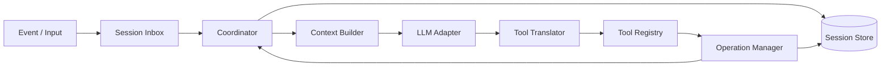
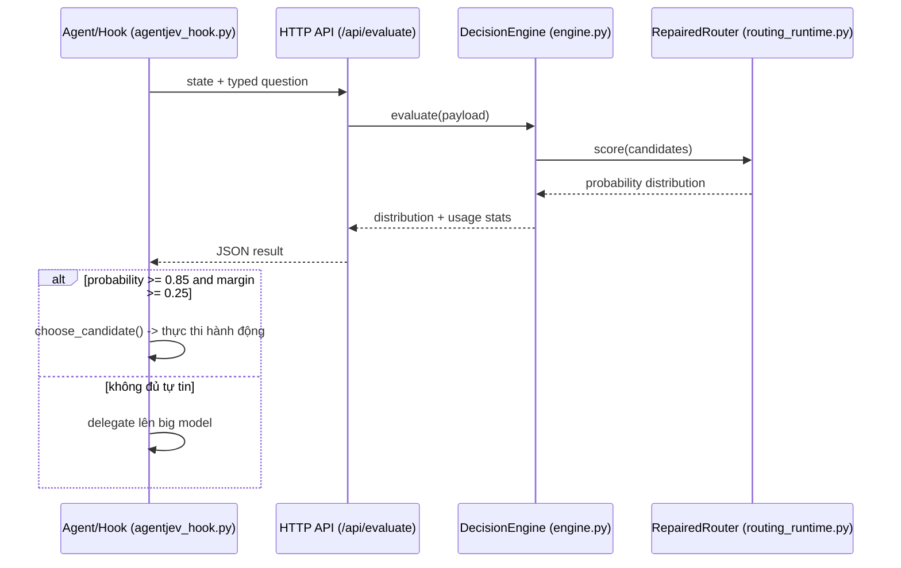
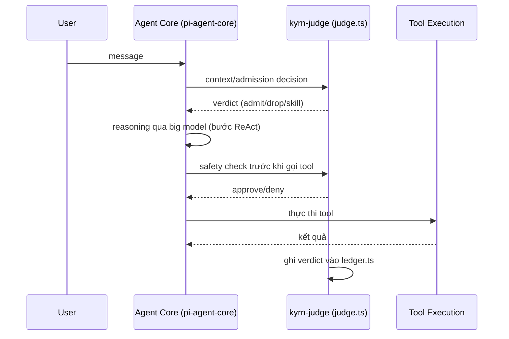
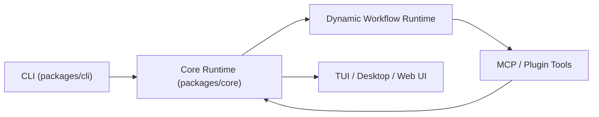

# Weekly Agentic AI Scan — 20/09/2026 → 27/09/2026

## Tóm tắt điều hành

- Xu hướng nổi bật nhất tuần này là **mô hình "judge" nhỏ tách khỏi big model** để xử lý các quyết định vặt (an toàn, routing, context admission) trong agent loop — xuất hiện độc lập ở cả `agent-jev` (model 0.6B chuyên dụng, không sinh token) và `mu` (judgment kernel `kyrn-judge` với 3 lựa chọn judge: Jev/Laya/LLM tuỳ ý), cho thấy đây không phải trùng hợp ngẫu nhiên mà là một pattern đang được nhiều nhóm độc lập hội tụ tới.
- `unreal-agent` (Unreal Labs) là harness async-first với thiết kế "durability-first" hiếm gặp ở agent OSS: persist input trước khi xử lý, session store hỗ trợ fork/resume, và bộ test coordinator có cả fault-fuzz/recovery-sequences — mức độ nghiêm túc về resilience gần với hệ thống production hơn là demo.
- `ZCode` (Z.ai) là ứng viên "production-grade" quy mô lớn nhất (6.8k sao, backed bởi Zhipu/Z.ai) nhưng độ minh bạch kiến trúc qua thư mục công khai thấp hơn 3 repo còn lại — nhiều nhận định trong bài này phải ghi "không xác định từ code" vì không đọc được source thực tế, chỉ tên package.

**Phạm vi quét:** ~17 repo được xem xét từ GitHub Search API (`created:>2026-09-20`, `stars:>200`) và một số cross-check qua WebSearch. Loại khỏi vòng phân tích sâu: `amitshekhariitbhu/ai-system-design`, `ai-engineering-course` (course/tutorial), `wuyoscar/jev-skill` (awesome-list dạng collection), `lhlGitHub/threejs-architecture-effects`, `feitangyuan/onetake`, `leter/zh-tech-writing` (agent *skill* đơn lẻ, không phải framework/harness, thiếu `/src` hoặc `/docs` kiến trúc), `mikehasa/golive-skill` và `freestylefly/WeChatBridge` (sản phẩm deploy/bridge, không có kiến trúc agent orchestration đáng phân tích), `penso/herdr-gpui` (client hiển thị, không phải agent core), `dzhng/jevgrep` và `Devin-AXIS/jev-dsh-decision` (tiện ích nhỏ, chưa đủ chiều sâu kiến trúc để tách thành mục riêng — được nhắc tới như bằng chứng cho xu hướng "Jev ecosystem"). 4 repo được chọn viết sâu bên dưới.

## Mục lục

1. [unreallabsai/unreal-agent](#repo-1-unreal-agent) — Async-first agent harness, durability-first
2. [malevrigns/agent-jev](#repo-2-agent-jev) — Model 0.6B "System 1" cho quyết định agent
3. [qybaihe/mu](#repo-3-mu) — Coding agent 2 tầng: judge nhỏ + big model
4. [zai-org/ZCode](#repo-4-zcode) — Workbench lập trình AI đa nền tảng của Z.ai

---

## 1. unreallabsai/unreal-agent

**Link:** https://github.com/unreallabsai/unreal-agent

### §1 — Quick context

Harness agent bất đồng bộ, ưu tiên durability và khả năng resume/fork session. Tech stack: Go (go.mod/go.sum), Docker, tích hợp OpenAI-compatible API (`internal/openaiapi`, `third_party/openai-openapi`), benchmark qua Harbor 0.22.0 + Terminal-Bench 4.0 (Modal). Repo health: ~2.000 sao, 103 fork, 135 commit trên `main`, tạo 21/09/2026, push gần nhất 23/09/2026, MIT license, có `.github/workflows` (CI) và `CONTRIBUTING.md`.

### §2 — Architecture deep-dive

**A. Component inventory** (từ cấu trúc `harness/`):
- **Session Inbox** (`harness/inbox/`) — dedup input volatile theo session, xử lý redelivery.
- **Coordinator** (`harness/coordinator/coordinator.go`, `loop.go`) — event loop trung tâm: `Run(context.Context) error`, wrap `Dependencies` (Sessions, Inbox, ContextBuilder, LLM, Tools, Operations).
- **Session Store** (`harness/sessionstore/`) — lưu lịch sử canonical append-only, hỗ trợ fork và recovery.
- **Context Builder** (`harness/contextbuilder/`) — lắp input cho model, chạy thuần không I/O.
- **LLM Adapter** (`harness/llm/`) — giao tiếp provider (qua lớp OpenAI-compatible).
- **Tool Registry & Translator** (`harness/tool/registry.go`, `tool.go`, `bash/`, `viewimage/`, `skill_use.go`) — định nghĩa capability theo schema, validate và convert lời gọi model thành operation.
- **Operation Manager** (`harness/operation/`) — thực thi operation bền vững (durable execution).
- **Primitives** (`harness/primitives/`) — kiểu dữ liệu dùng chung giữa các module.

**B. Control flow pattern:** Event-driven kết hợp durable state-machine loop (không phải LangGraph-style graph, không phải hierarchical supervisor). Happy path:
1. Input đến dưới dạng "event" có ID ổn định, toàn cục → Session Inbox dedup.
2. Coordinator **persist input vào Session Store trước khi xử lý** (durability-first — khác với hầu hết harness chỉ giữ state in-memory).
3. Context Builder lắp ngữ cảnh (lịch sử + tool schema) không phụ thuộc I/O.
4. LLM Adapter thực hiện một "LLM turn" — request/response với provider, có thể chứa tool call.
5. Tool Translator validate lời gọi theo schema (đồng bộ, không suspend loop), Tool Registry thực thi (Bash, ViewImage, skill-use).
6. Operation Manager dispatch kết quả thành operation bền, ghi lại Session Store; Coordinator lặp lại hoặc `Run()` trả về khi có stop control.

**C. State & data flow:** Message là "event" có ID ổn định (README nói rõ, chưa xác nhận được struct Go cụ thể qua listing). Session Store append-only, hỗ trợ fork — giống mô hình branching hơn key-value store thông thường. Loại storage backend cụ thể (in-memory/disk/DB): **không xác định từ code** đã quét (thiết kế theo interface nên có thể pluggable). Chiến lược quản lý context window (sliding/summarize): **không xác định từ code**.

**D. Tool/capability integration:** Tool = "capability described by a schema and bound to a translator" (`harness/tool/tool.go`). Cách gọi: model trả tool call, Translator parse & validate đồng bộ rồi Registry thực thi — tức native function-calling, không phải JSON-parsing tự chế lỏng lẻo. Sandbox thực thi Bash cụ thể: **không xác định từ code**.

**E. Memory:** Không có module memory dài hạn riêng biệt trong `harness/` — bỏ qua dimension này.

**F. Model orchestration:** LLM Adapter qua lớp OpenAI-compatible; benchmark harness hỗ trợ OpenAI, OpenRouter, Fireworks AI với "configurable reasoning levels" nhưng logic fallback/parallel cụ thể trong core: **không xác định từ code**.

**G. Observability & eval:** `benchmarks/harbor/` (Harbor 0.22.0 + tích hợp Terminal-Bench 4.0 qua Modal) ghi trajectory chi tiết, token usage, hỗ trợ smoke test bằng Docker. Bộ test coordinator gồm cả `fault_fakes_test.go`, `fault_fuzz_test.go`, `recovery_sequences_test.go`, `grace_test.go` — mức độ kiểm thử resilience hiếm gặp ở tuần đầu công bố.

**H. Extension points:** README nhấn mạnh "alternative implementations of their interfaces are encouraged" — kiến trúc theo Go interface cho phép thay Session Store, LLM Adapter, hay Tool Registry mà không đổi Coordinator.

### §3 — Architecture diagram

### §4 — Verdict

Điểm mới thực sự: thiết kế "persist-before-process" + session fork, cùng bộ test resilience (fault fuzz, recovery sequences) — đây là engineering nhắm tới production, không phải demo. Red flag: chưa có `docs/architecture.md` riêng (toàn bộ hiểu biết đến từ README + tên file); loại storage backend và chiến lược context-window cụ thể không xác định được. Câu hỏi mở: cơ chế sandbox cho tool Bash an toàn tới đâu; provider fallback logic có tồn tại thật hay chỉ multi-provider config đơn thuần — cần đọc trực tiếp `harness/llm/*.go`.

---

## 2. malevrigns/agent-jev

**Link:** https://github.com/malevrigns/agent-jev

### §1 — Quick context

Model quyết định 0.6B đóng vai "System 1" cho agent: trả phân phối xác suất calibrated trong ~50-70ms mà không sinh token nào. Tech stack: Python, PyTorch ≥2.0, Transformers ≥4.40 (backbone Qwen3-0.6B), weights trên HuggingFace (`aimeigaoshou/agent-jev`), Apache-2.0. Repo health: 309 sao, 27 fork, 15 commit trên `main`, tạo 21/09, push 23/09/2026; **không có `.github/workflows`** (không có CI chính thức) nhưng có bộ test/benchmark riêng (`test_coding_scenarios.py`, `test_game_suite.py`, `run_practical_test.py`, `jev_service/tests/`).

### §2 — Architecture deep-dive

**A. Component inventory:**
- **Model core** (`agentjev/model.py`) — backbone Qwen3-0.6B, bỏ LM head, thay bằng "small permutation-equivariant head" chấm điểm ứng viên.
- **Routing runtime** (`agentjev/routing_runtime.py`) — class `RepairedRouter` (`score()`), dataclass `Candidate`, hàm `grounded_candidates()` và `choose_candidate()`.
- **Routing data** (`agentjev/routing.py`, `routing_data.py`) — định nghĩa action space & chuẩn bị dữ liệu router.
- **Decision Engine / serving** (`jev_service/engine.py`) — class `DecisionEngine(checkpoint, model_path, device, max_tokens=2048, path_batch=16, ...)`: verify checkpoint bằng SHA256, infer bf16 + autocast, threading lock cho concurrency.
- **Contract** (`jev_service/contract.py`) — schema input/output cho HTTP API.
- **HTTP server** (`jev_service/server.py`) — expose `POST /api/evaluate`.
- **Candidate encoders** (`jev_service/candidate_v8.py`, `candidate_v9.py`) — hai phiên bản encode ứng viên (versioning).
- **Client & hook** (`agentjev_client.py`, `agentjev_hook.py`) — client Python + Claude Code PreToolUse hook gate Bash/Write/Edit.
- **Eval set** (`typed_decisions/`) — benchmark "Typed Decisions" (400 case, 2.000 câu hỏi).

**B. Control flow pattern:** Đây không phải một agent hoàn chỉnh mà là **judge/router microservice** được agent khác gọi — pattern gần nhất là "routing với ngưỡng tin cậy + abstain lên model lớn hơn". Happy path:
1. Caller (agent lớn qua `agentjev_hook.py`, hoặc client bất kỳ) gửi state + câu hỏi typed (boolean/choice/score) tới `/api/evaluate`.
2. `DecisionEngine` encode state một lần qua backbone Qwen3 (shared-prefix caching, giảm 92.4% token backbone ở tải rộng).
3. Scoring head đọc hidden state tại vị trí token ứng viên, sinh logits — **không decode token nào**.
4. Với use-case routing: `grounded_candidates()` liệt kê hành động đã tham số hoá đầy đủ (vd trích file cụ thể từ regex lỗi); `RepairedRouter.score()` chấm điểm từng candidate.
5. `choose_candidate()` áp ngưỡng xác suất (~0.85) và margin so với hạng nhì (~0.25); đạt ngưỡng → trả candidate, không đạt → trả `None` ("delegate") để leo thang lên big model.
6. Kết quả (phân phối xác suất, kèm usage stats) trả về caller; caller quyết định hành động cuối.

**C. State & data flow:** Input là JSON payload theo `contract.py`, giới hạn 2.048 token — **vượt giới hạn thì reject, không truncate** (thiết kế tránh silent data loss). Không có state lưu trữ lâu dài — service stateless theo từng request, cache chỉ ở mức KV-cache shared-prefix trong nội bộ một batch. Không áp dụng RAG/summarize vì đây là dịch vụ chấm điểm, không quản lý hội thoại.

**D. Tool/capability integration:** Không "gọi tool" — ngược lại, chính nó LÀ một tool/gate được agent khác gọi qua HTTP hoặc hook. `agentjev_hook.py` can thiệp sự kiện PreToolUse của Claude Code để chấm rủi ro an toàn/vận hành trước khi cho phép Bash/Write/Edit chạy — một dạng guardrail có thể đo lường (probability + margin) thay vì rule-based đơn thuần.

**E. Memory:** Không có — bỏ qua.

**F. Model orchestration:** Một backbone duy nhất (Qwen3-0.6B, 598M tham số), không có model dự phòng trong repo; mảnh "small model" này được thiết kế để cắm vào bên cạnh một big model nằm ngoài repo. Batch tối đa 32 state / 128 câu hỏi mỗi request.

**G. Observability & eval:** Benchmark "Typed Decisions" tự xây (400 case/2.000 câu hỏi) đo top-1 accuracy (79.25%), soft cross-entropy (0.8494), và latency so với baseline "Laya" (một model 322M khác — cũng xuất hiện trong `mu`, xem repo #3) ở cả tải hẹp lẫn tải rộng (64 lựa chọn). Đây là eval methodology định lượng, hiếm thấy ở repo mới công bố. Logging/tracing kiểu OpenTelemetry: **không xác định từ code**.

**H. Extension points:** Thêm loại câu hỏi mới đòi sửa `model.py` (đổi head) + retrain qua `train.py`; tích hợp agent khác chỉ cần tuân theo `contract.py` qua HTTP; hook mẫu cho Claude Code có thể copy sang harness khác.

### §3 — Architecture diagram

### §4 — Verdict

Điểm mới thực sự: bỏ hẳn text-generation cho quyết định nhị phân/lựa chọn, thay LM head bằng scoring head permutation-equivariant, đo latency thực tế và so sánh chéo với baseline khác ("Laya") — cách "datapoint hoá System 1" cho agent hiếm gặp ở OSS. Red flag: không có CI; weights nằm ngoài repo (HuggingFace) nên không kiểm chứng được từ code; benchmark là tự làm/tự chấm (self-reported), chưa có bên thứ ba xác nhận. Câu hỏi mở: "Laya" là ai/license gì — trùng tên với judge trong `mu` nhưng chưa rõ có cùng nguồn hay là hai nỗ lực song song.

---

## 3. qybaihe/mu

**Link:** https://github.com/qybaihe/mu

### §1 — Quick context

Coding agent hai tầng: một "judge" nhỏ nhanh xử lý quyết định vặt, big model tập trung làm việc chính; xây trên nền `pi` (`@earendil-works/pi-agent-core`) và `AionUi`. Tech stack: TypeScript monorepo (npm workspaces), Node ≥22.19, Biome, Vitest, Electron (desktop), MIT license. Repo health: 237 sao, 15 fork, tạo 22/09, push 25/09/2026, **CI khá đầy đủ**: `.github/workflows/{ci,desktop,npm-audit,npm,windows-permission,windows-tests}.yml`.

### §2 — Architecture deep-dive

**A. Component inventory:**
- **Judgment kernel** `kyrn-judge` (`packages/kyrn-judge/src/judge.ts`, `decision.ts`, `cascade.ts`, `policy.ts`, `ledger.ts`) — lớp harness gọi model nhỏ trả lời câu hỏi có/không hoặc trắc nghiệm tại các "decision point" trong agent loop; có submodule riêng cho `admission`, `permissions`, `memory`, `hive`, `swarm`, `checkpoint`, `compaction`.
- **Agent core** (`packages/agent`, gói `@earendil-works/pi-agent-core`) — "stateful agent with tool execution and event streaming", xây trên framework `pi`.
- **Coding agent** (`packages/coding-agent`) — logic chuyên biệt cho workflow coding.
- **Protocol** (`packages/protocol`) — message schema giữa client/server.
- **Durable** (`packages/durable`) — cơ chế thực thi bền vững.
- **Session backend** (`packages/session-backends/sqlite-node`) — lưu session bằng SQLite.
- **Telemetry** (`packages/telemetry`) — observability.
- **Evals** (`packages/evals/{docker,evals,src,test}`) — bộ eval hành vi riêng.
- **Client/Server/TUI/Desktop** (`packages/client`, `packages/server`, `packages/tui`, `desktop/`).

**B. Control flow pattern:** ReAct-style ở lõi (agent core kế thừa từ `pi`), được **augment bởi một lớp Judge-gate/cascade routing** xen vào ~35 decision point mỗi turn — gần với biến thể "dual-process supervisor" hơn là hierarchical supervisor-workers cổ điển. Happy path:
1. User gửi message → Input phase: `kyrn-judge` phân loại message/task framing trước khi đưa vào agent chính.
2. Agent core build context — Context phase: judge quyết định skill nào được "disclosure", tool-output nào được admit, có cần gọi memory hay không.
3. Agent core gọi big model, sinh reasoning + tool call (bước ReAct chuẩn).
4. Trước khi thực thi tool: Safety phase — judge chấm rủi ro lệnh (tương tự PreToolUse gate), quyết định cần approval hay không.
5. Turn management: judge phát hiện "drift" (lạc đề), xác minh completion, cập nhật "board" tiến độ.
6. Mỗi decision point cấu hình judge riêng (`active`/`shadow`/`off`) — chọn Jev (hosted, ~0.3s/câu hỏi), Laya (local 322M, offline), hoặc bất kỳ LLM nào (`llm:<provider>/<model>`); verdict được ghi vào `ledger.ts` để audit.

**C. State & data flow:** Session lưu qua SQLite (`session-backends/sqlite-node`); giao tiếp giữa client/server qua `protocol` package (typed schema, không phải raw string, dựa trên sự tồn tại của package `protocol` + `types.ts`/`contract` trong `kyrn-judge`). Quản lý context window: README nói rõ **"tool output enters chunk by chunk and stale results are dropped without a summary"** — tức chiến lược *pruning theo chunk*, khác hẳn RAG hay summarize truyền thống.

**D. Tool/capability integration:** Kế thừa native function-calling từ `pi-agent-core` ("tool execution and event streaming"); `kyrn-judge` thêm lớp gate/permission (`src/permissions`, `src/admission`) chạy trước khi tool thực thi — validation ở mức policy/probability, cơ chế sandbox code-execution cụ thể **không xác định từ danh sách file**.

**E. Memory architecture:** Có (`kyrn-judge/src/memory/`). Đặc điểm nổi bật: việc "nhớ" (capture) và "gọi lại" (recall) đều là một loại decision point do judge quyết định — nghĩa là ghi/đọc long-term memory bị gate bởi judge thay vì tự động lưu mọi thứ. Phương pháp retrieval cụ thể (vector/keyword/hybrid): **không xác định từ code**.

**F. Model orchestration:** 3 lựa chọn judge độc lập với big model chính, cấu hình qua `mu.json`/`kyrn.json`: Jev (hosted qua TypeSafe/OpenRouter/Vercel AI Gateway), Laya (local 322M offline), hoặc LLM tuỳ ý. Cơ chế fallback khi Jev hosted timeout: **không xác định từ code**.

**G. Observability & eval:** `packages/telemetry` cho observability (chuẩn cụ thể — OpenTelemetry hay tự chế — không xác định từ tên thư mục). `packages/evals` có 2 phương pháp rõ ràng: "documentation-lift" evals (so sánh có/không tài liệu, chạy cô lập trong Docker với quyền tool hạn chế) và "host evals" chạy local bằng Vitest, đo "pass-rate lift" — cùng với 6 workflow CI riêng biệt (kể cả `windows-tests`, `npm-audit`), đây là mức production-engineering cao so với quy mô 237 sao.

**H. Extension points:** Thêm judge mới chỉ cần khai báo `llm:<provider>/<model>` trong config, không cần sửa code; thêm agent con qua lệnh `/swarm` (hive); mở rộng theo package mới trong workspace `packages/`.

### §3 — Architecture diagram

### §4 — Verdict

Điểm mới thực sự: tách các quyết định "meta" (context admission, safety, drift-detection, completion-check) khỏi big model bằng một kernel riêng, **có thể audit** (ledger) và cấu hình theo từng decision point ở chế độ `shadow` — cho phép A/B test một judge mới trước khi bật thật, đây là pattern kỹ thuật khá chín muồi hiếm thấy ở repo 1 tuần tuổi. Red flag: phần lớn "agent core" thực chất nằm ngoài repo (kế thừa từ `pi` + `AionUi`), nên đây gần với "harness bọc quanh agent framework có sẵn" hơn là framework từ đầu — cần đọc kỹ để phân biệt phần mu tự viết (chủ yếu là `kyrn-judge`) với phần thừa hưởng. Câu hỏi mở: hiệu năng thực tế của Jev/Laya trong `mu` (chỉ có claim ~0.3s, benchmark định lượng nằm ở repo `agent-jev` khác, chưa rõ liên hệ trực tiếp).

---

## 4. zai-org/ZCode

**Link:** https://github.com/zai-org/ZCode

### §1 — Quick context

Workbench lập trình AI đa bề mặt (desktop/web/CLI) từ Z.ai (Zhipu), chia sẻ chung một agent runtime. Tech stack: TypeScript/Node monorepo (pnpm + turbo), Electron (desktop), CLI "zero production dependencies" đóng gói SEA, hỗ trợ MCP (stdio/HTTP/SSE) và plugin marketplace. Apache-2.0. Repo health: ~6.8k sao, ~2.1k fork — lớn nhất trong 4 repo, được backing bởi một AI lab (Z.ai/GLM); `.github/workflows` ở root **trả 404 khi truy vấn trực tiếp** (không xác nhận được CI công khai qua path này); có `husky` pre-commit hook.

### §2 — Architecture deep-dive

**A. Component inventory** (từ `apps/zcode-cli/packages/`):
- **CLI** (`apps/zcode-cli/packages/cli`) — parse lệnh, wiring process.
- **Core runtime** (`apps/zcode-cli/packages/core/src`) — logic runtime dùng lại; `package.json` cho thấy export thêm module `repl`, `browser-client`, và một tool tên `create-workflow-graph-bounds`.
- **TUI** (`apps/zcode-cli/packages/tui`) — lớp giao diện terminal.
- **Dynamic workflow** (`apps/zcode-cli/packages/dynamic-workflow`, `dynamic-workflow-runtime`) — engine workflow động (tên gọi + tool `graph-bounds` gợi ý mô hình dạng graph).
- **Adapters / Contracts / Shared-types** (`packages/adapters`, `packages/contracts`, `packages/shared-types`) — hợp đồng kiểu dữ liệu & thích ứng provider.
- **Bootstrap** (`packages/bootstrap`) — khởi tạo runtime.
- **Telemetry** (`packages/telemetry`).
- Provider/Plugin system: theo README, plugin lưu tại `~/.zcode/cli/plugins/`, built-in gồm Browser Use, Document Skills, Skill Creator, ZCode Guide.

**B. Control flow pattern:** Bằng chứng file-level **không đủ chi tiết** để khẳng định chắc đây là graph engine kiểu LangGraph thuần tuý; tuy nhiên tên package `dynamic-workflow-runtime` + tool `create-workflow-graph-bounds` là bằng chứng cụ thể cho một dạng **state machine/graph (workflow graph)**, bao quanh bởi hook lifecycle kiểu event-driven (`SessionStart`, `UserPromptSubmit`, `PreToolUse`, `Stop` — theo README, tương tự mô hình hook của Claude Code). Gọi tên: **hybrid event-driven + dynamic workflow graph**. Happy path (một số bước suy từ tên package/README, không xác nhận được từ source thực tế):
1. CLI (`packages/cli`) nhận input, trigger hook `SessionStart`/`UserPromptSubmit`.
2. Core runtime dựng agent loop; `dynamic-workflow-runtime` thực thi node hiện tại của workflow graph.
3. Model được gọi qua Provider System (Node.js plugin) — provider cụ thể nào đang active: **không xác định từ code**.
4. Nếu node cần tool: gọi qua MCP server (stdio/HTTP/SSE) hoặc plugin skill; hook `PreToolUse` chạy trước khi thực thi.
5. Kết quả cập nhật state runtime; workflow graph chuyển sang node kế tiếp hoặc dừng ở hook `Stop`.
6. UI (TUI/Desktop/Web) render qua các package riêng, đồng bộ qua RPC framework (theo README gốc, dùng Zustand phía renderer).

**C. State & data flow:** Có `shared-types` và `contracts` gợi ý typed schema giữa các package, nhưng nội dung schema cụ thể **không xác định từ danh sách file** đã quét (chưa đọc được source `.ts` thực tế). State storage: **không xác định** — không thấy Redis/SQLite trong các thư mục cấp cao đã quét. Chiến lược quản lý context window: **không xác định từ code**.

**D. Tool/capability integration:** MCP (stdio/HTTP/SSE) là cơ chế chính thức theo README — đây là tích hợp MCP native rõ ràng nhất trong 4 repo, cộng thêm plugin system riêng cho skill/custom command. Validation/sandbox cụ thể cho tool call: **không xác định từ danh sách file** đã quét.

**E. Memory:** **Không xác định từ code** đã xem — bỏ qua.

**F. Model orchestration:** Kiến trúc "Provider System" dạng plugin Node.js cho phép cắm nhiều model provider, nhưng logic chọn/fallback giữa các provider: **không xác định từ file đã xem**.

**G. Observability & eval:** Có package `telemetry`; không tìm thấy package `evals` hay tài liệu eval hooks/replay tương đương `mu` trong các thư mục đã quét — **không xác định từ code**.

**H. Extension points:** Plugin marketplace + cấu hình MCP server là điểm mở rộng chính thức (thêm skill/tool/agent qua plugin bundle, không cần sửa core); thêm model provider mới qua Provider System.

### §3 — Architecture diagram

### §4 — Verdict

Điểm mới thực sự: hợp nhất desktop/web/CLI trên cùng một runtime core, cộng plugin marketplace + MCP native, cho thấy mức đầu tư kỹ thuật (SEA packaging, CLI zero-prod-deps, turbo monorepo) ở quy mô công ty (Z.ai) chứ không phải side-project. Red flag lớn nhất: đây là repo có **độ minh bạch kiến trúc thấp nhất trong 4 repo** — nhiều dimension quan trọng (message schema thực tế, state storage, model fallback, sandbox) chỉ suy được từ tên thư mục/package.json, chưa đọc được source `.ts` bên trong; `.github/workflows` không xác nhận được qua path chuẩn. Câu hỏi mở lớn nhất: `dynamic-workflow-runtime` có thực sự là graph engine dạng LangGraph (nodes/edges tường minh) hay chỉ là workflow tuần tự được đặt tên "graph" — cần đọc trực tiếp `apps/zcode-cli/packages/dynamic-workflow-runtime/src/*.ts` để xác nhận, việc này nằm ngoài khả năng truy cập của lần quét này (GitHub API repo-content endpoints bị chặn trong phiên này, chỉ dùng được trang HTML tree và raw file thô).

---

*Ghi chú phương pháp: dữ liệu được thu thập qua GitHub Search API (`api.github.com/search/repositories`) và WebFetch trên trang HTML `github.com/{owner}/{repo}/tree/...` cùng `raw.githubusercontent.com` (endpoint `api.github.com/repos/{owner}/{repo}` và `/contents/` bị proxy chặn trong phiên này nên không dùng được cho metadata/listing trực tiếp — phải suy ra qua trang HTML, có thể thiếu chính xác tuyệt đối về số liệu như số contributor). Mọi nhận định kiến trúc được gắn với đường dẫn file cụ thể khi có bằng chứng; các mục ghi "không xác định từ code" là những chỗ chưa đọc được source thực tế trong lần quét này, không phải suy đoán.*
