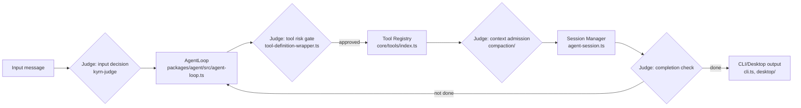
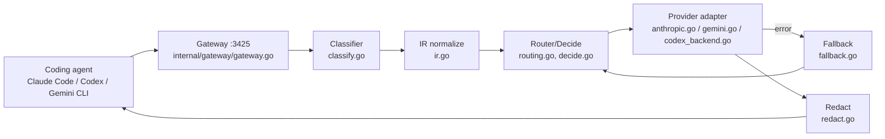
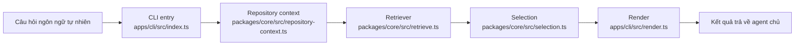

# Weekly Agentic AI Research Scan — 2026-09-28

**Nguồn dữ liệu:** GitHub Search API (`created:>2026-09-21 stars:>200`, query `agent OR multi-agent OR agentic`), truy xuất qua `api.github.com`/`raw.githubusercontent.com`/trang repo công khai (không dùng `gh` CLI — session này không có quyền GitHub App ngoài phạm vi `undertheseanlp/underthesea`, nên toàn bộ nghiên cứu bên ngoài dùng WebFetch/WebSearch tới các endpoint công khai, không xác thực).

**Executive summary:**
- Tuần này nổi bật là pattern **"small judge + big model"**: `mu` tách 35 điểm quyết định/turn ra một judge nhỏ (322M param hoặc hosted) để giảm chi phí/latency mà vẫn giữ oversight — đáng học nhất tuần.
- `magpie` là một **local API gateway** (Go) dịch giữa OpenAI/Anthropic/Gemini format với pipeline `classify → decide → forward → fallback` có test-coverage rõ ràng cho từng vendor — một case study tốt về routing production-grade hơn là "agent" theo nghĩa cổ điển.
- `jevgrep` áp dụng retrieval-as-a-tool cho coding agent với eval SWE-bench thực đo (8/10 task, giảm ~29% chi phí) — hiếm thấy repo tuần này có benchmark định lượng đi kèm.
- **Cảnh báo riêng:** `Seep-Reverse-Lab` (mục 4) tự mô tả có cơ chế "anti-refusal override" nhắm vào các coding agent (Claude Code, Pi Agent...) — đây là red flag nghiêm trọng, xem §4 của repo đó.

## Mục lục
1. [mu (qybaihe/mu)](#1-mu-qybaihemu)
2. [magpie (yetone/magpie)](#2-magpie-yetonemagpie)
3. [jevgrep (dzhng/jevgrep)](#3-jevgrep-dzhngjevgrep)
4. [Seep-Reverse-Lab (angusdevgo/Seep-Reverse-Lab)](#4-seep-reverse-lab-angusdevgoseep-reverse-lab)

---

## 1. mu (qybaihe/mu)

**Link:** https://github.com/qybaihe/mu

### §1 — Quick context
Coding agent dùng "judge" nhỏ quyết định 35 điểm quyết định/turn, giữ model lớn tập trung viết code. Stack: TypeScript monorepo (npm workspaces, Node ≥22.19), xây trên framework **pi** (MIT) và **AionUi** (Apache-2.0); judge có 3 lựa chọn — Jev (hosted qua TypeSafe/OpenRouter/AI Gateway), Laya (model local 322M tham số), hoặc LLM tuỳ chỉnh. Repo health: 275 sao, 28 fork, ~6.800 commit, có badge CI workflow + desktop build + npm (`mu-agent`) → có CI/test pipeline thực.

### §2 — Architecture deep-dive

**A. Component inventory**
- `AgentLoop` (`packages/agent/src/agent-loop.ts`, `agent.ts`, `node.ts`, `proxy.ts`) — vòng lặp điều phối turn: gọi model, xử lý stream, tool call.
- `Judgment Kernel / kyrn-judge` (`packages/kyrn-judge/src/`, `agents/`, `prompts/`, `skills/`) — "harness layer" cung cấp phán quyết nhanh (yes/no, scoring) cho các decision point; README gọi đây là backend pluggable (Laya sidecar / HTTP / generative model).
- `Tool Registry` (`packages/coding-agent/src/core/tools/index.ts` cùng `bash.ts`, `edit.ts`, `edit-diff.ts`, `grep.ts`, `read.ts`, `write.ts`, `find.ts`, `ls.ts`, `tool-definition-wrapper.ts`) — tập tool file-system/shell, có wrapper riêng để bọc rủi ro trước khi thực thi.
- `Compaction` (`packages/coding-agent/src/core/compaction/`) — module nén ngữ cảnh khi context gần đầy.
- `Session Manager` (`packages/coding-agent/src/core/agent-session.ts`, `agent-session-runtime.ts`, `agent-session-services.ts`, `session-manager.ts`) — quản lý vòng đời phiên, hỗ trợ import hội thoại cũ từ Claude Code/Codex.
- `CLI & Desktop entry` (`packages/coding-agent/src/cli.ts`, `main.ts`, `rpc-entry.ts`; thư mục `desktop/`) — hai giao diện: CLI (`mu`) và app desktop hiển thị work panel, judgments ledger, hive visualization.

Riêng cơ chế **Hive** (multi-agent "bees" publish/relate finding qua `hive.publish`, `hive.relate`) và **Plain-Language Board** được mô tả chi tiết trong README nhưng file nguồn cụ thể **không xác định được** trong lần scan này (GitHub code search yêu cầu đăng nhập nên không tra được vị trí chính xác; nhiều khả năng nằm trong `packages/kyrn-judge/agents/` hoặc `packages/coding-agent/src/modes/`, chưa verify) — vì vậy không đưa vào diagram §3.

**B. Control flow — pattern nào?**
Không phải ReAct thuần hay planner-executor cổ điển, mà là **gated agent loop**: mỗi bước trong turn phải qua một "judgment gate" trước khi thực thi.
1. Input đến → judge phân loại message, xác định có đổi task-frame không (input decision).
2. `AgentLoop` gọi model chính sinh phản hồi/tool call.
3. Trước khi tool chạy, judge chấm điểm rủi ro + kiểm tra constraint qua `tool-definition-wrapper.ts` (safety decision).
4. Judge quyết định tool-output nào được "admit" vào context, phần nào bị gửi sang `compaction/` (context decision).
5. Judge phát hiện "drift"/dead-end, xác minh completion trước khi kết turn (turn decision).
6. Nếu có sub-task, judge định tuyến sang sub-agent và (theo README) publish finding lên board chung (teamwork decision).

**C. State & data flow**
Message format nội bộ có `types.ts` trong `packages/agent/src` nhưng schema cụ thể không xác định từ tên file. README mô tả context được quản lý theo "chunk-by-chunk admission" + loại bỏ kết quả cũ ("stale result removal") — tức selective/sliding admission, không phải RAG. State phiên khả năng lưu SQLite qua workspace `packages/session-backends/sqlite-node` (thấy trong `package.json` gốc).

**D. Tool integration**
Tool đăng ký tập trung ở `core/tools/index.ts`; lệnh gọi tool bị chặn bởi lớp risk-assessment của judge trước khi cho thực thi — khác cách "function-calling thuần" vì có gate an toàn trung gian. Có tool bash/powershell (`bash.ts`, `powershell.ts`) nên cần sandbox; cơ chế sandbox cụ thể không xác định từ các file đã xem, nhưng `pi-monorepo/package.json` liệt kê `@anthropic-ai/sandbox-runtime` ở devDependencies gốc — gợi ý có dùng sandbox runtime này ở đâu đó trong monorepo, chưa verify vị trí.

**E. Memory**
Short-term: context trong session + `compaction/`. Long-term/"lessons management" được nhắc trong tính năng desktop nhưng không tìm thấy file/module tương ứng → không xác định từ code.

**F. Model orchestration**
Model lớn (cấu hình qua `model-config.ts`, `model-registry.ts`) đảm nhiệm coding chính; judge nhỏ/nhanh (Laya 322M hoặc Jev hosted) xử lý 35 decision-point/turn — ví dụ rõ ràng của pattern tách vai trò theo chi phí/latency giữa hai tier model.

**G. Observability & eval**
Desktop app có "judgments ledger" — lịch sử quyết định của judge, dạng eval/replay thủ công trực quan. Không thấy OpenTelemetry/Langfuse trong `package.json` gốc → không xác định có tracing engineering chuẩn ngành hay không (có package `telemetry` riêng trong workspace nhưng nội dung chưa xem).

**H. Extension points**
`packages/coding-agent/src/core/extensions/` cùng các ví dụ liệt kê trong `package.json` workspaces (`examples/extensions/with-deps`, `custom-provider-anthropic`, `custom-provider-gitlab-duo`, `sandbox`, `gondolin`) cho thấy cơ chế plugin provider/tool tùy biến khá rõ ràng và có ví dụ thật.

### §3 — Architecture diagram

### §4 — Verdict
**Novel:** Tách quyết định "meta" (có nên chạy tool này, có nên nén context, turn đã xong chưa) ra khỏi model chính bằng một judge nhỏ/rẻ, đo đếm cụ thể ("35 decision point/turn") — khác hẳn cách đa số agent framework dồn mọi quyết định vào một model lớn duy nhất. Đây là dạng "policy/value model tách biệt" áp cho coding agent, hiếm thấy được engineering hoá rõ ràng đến vậy. **Red flag:** nhiều thành phần chủ lực trong pitch (Hive, lessons management) chỉ xác nhận được qua README, chưa định vị được file nguồn trong lần scan này. **Câu hỏi mở:** Laya (322M param) được huấn luyện/fine-tune ra sao và có drift khi áp cho codebase lớn không; `hive.relate` phân loại supersede/support/contradict giữa các finding hoạt động cụ thể thế nào.

---

## 2. magpie (yetone/magpie)

**Link:** https://github.com/yetone/magpie

### §1 — Quick context
Local gateway + menu-bar app gom quản lý model cho 23+ coding agent (Claude Code, Codex, Gemini CLI...) qua một endpoint duy nhất. Stack: Go (binary <15MB desktop / 7MB terminal), macOS/Linux/Windows, license MIT. Repo health: 1.316 sao, 75 fork, có CI badge + nhiều file `_test.go` song song mỗi module nghiệp vụ (ví dụ `classify_test.go`, `routing_test.go`, `fallback_test.go`) → test coverage theo module rõ ràng.

### §2 — Architecture deep-dive

**A. Component inventory**
- `Gateway` (`internal/gateway/gateway.go`) — HTTP server lắng nghe `127.0.0.1:3425`, expose `/v1/chat/completions`, `/v1/messages`, `/v1beta/models/{model}:generateContent`.
- `IR (Intermediate Representation)` (`internal/gateway/ir.go`) — chuẩn hoá request giữa 3 định dạng API (OpenAI/Anthropic/Gemini) về một dạng trung gian.
- `Classifier` (`internal/gateway/classify.go`) — nhận diện định dạng/loại request đến.
- `Router/Decision` (`internal/gateway/routing.go`, `decide.go`, `rules.go`, `affinity.go`) — chọn provider/model theo routing-group strategy (`smart`/`order`/`rotate`/`usage`).
- `Fallback handler` (`internal/gateway/fallback.go`) — retry sang provider khác khi lỗi.
- `Provider adapters` (`internal/gateway/anthropic.go`, `gemini.go`, `codex_backend.go`, `devin.go`, `kiro.go`, `cursor.go`, `codeassist.go`, cùng `internal/provider/`) — dịch request/response cho từng vendor, kể cả streaming (`sse.go`) và ảnh (`image_input.go`).
- `Redact` (`internal/gateway/redact.go`) — lọc dữ liệu nhạy cảm.
- `Claude subscription bridge` (`internal/gateway/claude_subscription.go`, `claude_warmup.go`, `internal/claudebridge/`) — "drive" trực tiếp binary `claude` cho các subscription Claude để tránh bị hệ thống vendor phân loại là traffic bên thứ ba.
- `Profile/Settings/Sessions` (`internal/profile/`, `internal/settings/`, `internal/sessions/`) — lưu profile model, cấu hình từng agent, chỉnh sửa file config "phẫu thuật" (chỉ đổi đúng key, giữ nguyên comment/format).
- `TUI/GUI` (`internal/tui/`, `internal/gui/`, root `gui_on.go`/`gui_off.go`) — giao diện terminal và menu-bar desktop.

**B. Control flow — pattern nào?**
Đây không phải agent loop theo nghĩa ReAct/planner-executor, mà là **request-routing pipeline** dạng gateway/proxy — gần với state-machine xử lý theo từng request:
1. Coding agent (Claude Code, Codex...) gửi request tới gateway tại `127.0.0.1:3425`.
2. `classify.go` xác định định dạng API gốc (OpenAI/Anthropic/Gemini), `ir.go` chuẩn hoá về IR nội bộ.
3. `decide.go`/`routing.go` chọn provider theo routing-group strategy đã cấu hình (`smart` mặc định, quota-aware).
4. Request được forward qua provider adapter tương ứng (`anthropic.go`/`gemini.go`/`codex_backend.go`...); `redact.go` áp filter nếu bật.
5. Nếu lỗi, `fallback.go` retry sang provider/model kế tiếp trong group.
6. Response được dịch ngược về đúng format ban đầu và stream lại cho agent qua `sse.go`.

**C. State & data flow**
Message format: JSON theo 3 chuẩn API khác nhau, được đưa về IR nội bộ (`ir.go`) trước khi route — đây là điểm thiết kế đáng chú ý vì tránh việc phải viết N×N cặp chuyển đổi giữa các vendor. State lưu file: `~/.config/magpie/providers.json` (quyền 0600), `profiles.json`, cache model tại `~/.cache/magpie/models.json`. Không có context-window management vì đây là gateway stateless theo request, không phải agent giữ hội thoại.

**D. Tool/capability integration**
Không áp dụng theo nghĩa "tool-calling của agent" — thay vào đó "capability" ở đây là các **provider adapter** được đăng ký trong `internal/provider/`; validate/sandbox không xác định rõ từ tên file (không thấy module sandbox riêng), nhưng có `internal/redact` đóng vai trò guard dữ liệu nhạy cảm trước khi rời máy.

**E. Memory**
Không có memory dài hạn kiểu agent (đúng bản chất là gateway); "memory" gần nhất là cache model catalog (`~/.cache/magpie/models.json`) và `internal/filememo/` — vai trò chính xác của `filememo` không xác định từ tên file, cần đọc thêm.

**F. Model orchestration**
Không phải orchestration nhiều model trong một tác vụ, mà là **model selection per routing-group**: nhiều model được gom vào một "routing group" và gateway chọn 1 theo strategy (`smart`/`order`/`rotate`/`usage`) mỗi request — có thể xem là dạng load-balancer cho model thay vì multi-agent orchestration cổ điển.

**G. Observability & eval**
`internal/usage/` (usage tracking) và `internal/gateway/trace.go`, `capture.go` cho thấy có tracing/logging nội bộ, nhưng không xác định có tích hợp OpenTelemetry/Langfuse chuẩn ngành hay chỉ là log tự viết. Test coverage rất rộng (gần như mỗi file `.go` nghiệp vụ có `_test.go` song song) — điểm mạnh về engineering hygiene hiếm thấy ở repo tuần tuổi.

**H. Extension points**
Thêm provider mới qua preset hoặc "custom vendor" (theo README); còn có cơ chế import cấu hình qua deep-link `magpie://import?preset=...` hoặc URL trên `usemagpie.ai/import#...` — một extension point hướng người dùng cuối hơn là hướng lập trình viên.

### §3 — Architecture diagram

### §4 — Verdict
**Novel:** IR-based translation layer (`ir.go`) giải quyết bài toán N-vendor × N-agent bằng một tầng trung gian duy nhất, thay vì viết adapter chéo từng cặp — đây là pattern router/gateway kỹ, không phải "wrapper mỏng". Việc "drive" trực tiếp binary `claude` cho subscription thay vì gọi API để tránh bị phân loại traffic bên thứ ba là một chi tiết engineering thực dụng, hiếm thấy nói thẳng trong README. **Red flag:** hành vi né phân loại traffic vendor (dù mục đích là hợp thức hoá subscription cá nhân, không phải để lạm dụng) đáng được người dùng magpie tự đánh giá rủi ro về ToS. **Câu hỏi mở:** `internal/filememo/` dùng để làm gì; cơ chế `smart` routing "subscription quota-aware" tính quota như thế nào (polling vendor hay ước lượng nội bộ).

---

## 3. jevgrep (dzhng/jevgrep)

**Link:** https://github.com/dzhng/jevgrep

### §1 — Quick context
CLI cho coding agent "tìm code bằng cách hỏi nó làm gì" thay vì grep từ khoá — semantic retrieval giảm ~29% chi phí agent. Stack: TypeScript, Bun workspaces + Turborepo, hỗ trợ Python (qua Python worker) và TS/JS; providers: Vercel AI Gateway, TypeSafe, OpenRouter, OpenCode Zen. Repo health: 858–860 sao, 52 fork, MIT license, có `evals/` benchmark riêng và `.github/workflows` (CI) → có eval + CI thực.

### §2 — Architecture deep-dive

**A. Component inventory**
- `CLI entry` (`apps/cli/src/index.ts`, `args.ts`) — parse lệnh `jg auth`, `jg skill`, câu hỏi tự nhiên ngữ.
- `Auth` (`apps/cli/src/auth.ts`) — xác thực với provider (Vercel AI Gateway/TypeSafe/OpenRouter/OpenCode Zen).
- `Skill installer` (`apps/cli/src/skill.ts`) — cài "agent skill" để Claude Code/Codex... gọi jevgrep như một skill/tool.
- `Render` (`apps/cli/src/render.ts`) — định dạng output (file liên quan, "reading leads", excerpt) để agent tiêu thụ.
- `Retriever` (`packages/core/src/retrieve.ts`) — module lõi truy hồi file/đoạn code liên quan tới câu hỏi.
- `Selection` (`packages/core/src/selection.ts`, `test-body-selection.ts`) — chọn lọc đoạn code/test liên quan để trả về.
- `Evaluator` (`packages/core/src/evaluator.ts`) — (có khả năng) chấm điểm mức liên quan của kết quả trước khi trả — vai trò chính xác trong pipeline không xác định chi tiết vì chưa đọc source.
- `Repository context` (`packages/core/src/repository-context.ts`, `source.ts`, `filesystem.ts`) — quét/parse cấu trúc repo.
- `Python bridge` (`packages/core/src/python.ts`, `python-worker.mjs`) — worker riêng để parse/handle code Python (ngôn ngữ khác runtime chính TS).
- `Providers` (`packages/core/src/providers.ts`) — tầng abstraction gọi các LLM provider khác nhau.
- `Cache` (`packages/core/src/cache.ts`) — cache kết quả truy hồi/gọi model.
- `Evals` (thư mục gốc `evals/`) — bộ benchmark SWE-bench dùng để đo cost/accuracy.

**B. Control flow — pattern nào?**
Đây là pattern **retrieval-as-a-tool** (không phải full agent loop) — jevgrep tự nó không lập kế hoạch hay hành động nhiều bước, mà đóng vai trò một "tool" được agent khác (Claude Code, Codex...) gọi trong vòng lặp của chính agent đó:
1. Agent chủ (ví dụ Claude Code) gặp câu hỏi cần tìm code, gọi jevgrep qua skill đã cài (`skill.ts`) hoặc CLI trực tiếp.
2. `index.ts`/`args.ts` parse câu hỏi ngôn ngữ tự nhiên (vd: "Where is authentication checked before a request reaches a handler?").
3. `repository-context.ts`/`source.ts` quét cấu trúc repo, `python.ts`/`python-worker.mjs` xử lý riêng phần Python nếu có.
4. `retrieve.ts` + `selection.ts` truy hồi và chọn lọc file/đoạn liên quan, có thể qua `evaluator.ts` để lọc/chấm điểm.
5. `render.ts` định dạng kết quả (file liên quan, reading leads, excerpt) trả về agent chủ trong một lần gọi duy nhất.
6. Agent chủ dùng kết quả này để tiếp tục vòng lặp code của chính nó (jevgrep không giữ session lâu dài).

**C. State & data flow**
Message format: input là câu hỏi ngôn ngữ tự nhiên (string), output là cấu trúc gồm file list + excerpt (định dạng cụ thể không xác định — cần đọc `types.ts` trong `packages/core`, chưa có trong lần scan). Có `cache.ts` cho thấy kết quả truy hồi được cache lại giữa các lần gọi, giảm chi phí gọi lại model. Không thấy vector DB được nêu tên trong cấu trúc thư mục hay README → cơ chế retrieval cụ thể (embedding-based hay static-analysis/AST-based) **không xác định rõ từ danh sách file**, vì có cả hướng gợi ý AST-parsing (Python/TS declaration parsing theo mô tả README) lẫn có thể có phần semantic/embedding qua `evaluator.ts`.

**D. Tool/capability integration**
jevgrep tự đóng vai trò tool được cài như "agent skill" (`jg skill`) — tức tích hợp qua cơ chế skill/tool-definition của agent chủ (ví dụ Claude Skills), không phải MCP theo tên gọi rõ ràng trong các file đã xem. Có bước lọc dữ liệu nhạy cảm được README nhắc tới ("choose a search root you intend to send") nhưng không phải guarantee tuyệt đối theo chính lời cảnh báo của tác giả.

**E. Memory**
Không có long-term memory theo nghĩa agent; "memory" ở đây chỉ là `cache.ts` cho kết quả truy hồi trong phạm vi một repo/phiên.

**F. Model orchestration**
`providers.ts` cho thấy có abstraction đa provider (Vercel AI Gateway, TypeSafe, OpenRouter, OpenCode Zen) nhưng không thấy phân vai rõ "model nhỏ cho việc X, model lớn cho việc Y" trong danh sách file — khác với `mu`, ở đây orchestration đơn giản hơn: chọn 1 provider/model cho tác vụ retrieval.

**G. Observability & eval**
Điểm mạnh nhất của repo: `evals/` chứa benchmark SWE-bench thực đo — 8/10 task Python SWE-bench thành công (ngang baseline) nhưng giảm cost từ $7.62 → $5.44 (~29%). Đây là non-trivial eval methodology hiếm gặp ở repo mới 1 tuần tuổi, đúng tiêu chí ưu tiên của đợt scan này.

**H. Extension points**
Cài đặt như skill cho nhiều agent khác nhau qua `jg skill`; hỗ trợ nhiều LLM provider qua cấu hình auth (`jg auth`) — extension point chủ yếu ở tầng provider, không thấy plugin API cho custom retriever trong các file đã liệt kê.

### §3 — Architecture diagram

### §4 — Verdict
**Novel:** Định vị rõ ràng jevgrep như một "tool trong tay agent khác" thay vì một agent độc lập, và **đo lường trực tiếp** hiệu quả kinh tế của việc đó bằng SWE-bench (giảm cost mà giữ nguyên tỉ lệ giải quyết task) — đây là bằng chứng thực nghiệm hiếm thấy, thay vì chỉ tuyên bố suông "giúp agent tiết kiệm token". **Red flag:** cơ chế retrieval lõi (embedding/vector vs. static-analysis/AST) không thể xác định chắc chắn chỉ từ tên file — cần đọc `evaluator.ts`/`retrieve.ts` thật để biết đây là "semantic search" đúng nghĩa hay chủ yếu dựa trên phân tích cú pháp. Cảnh báo về rò rỉ dữ liệu khi gửi code lên provider bên thứ ba được tác giả tự nêu, đáng chú ý cho use-case với repo nhạy cảm. **Câu hỏi mở:** benchmark chỉ chạy trên 10 task Python SWE-bench — quá nhỏ để tổng quát hoá, cần xem N lớn hơn và có test trên TypeScript không (README chỉ nói "supports" TS/JS parsing, chưa có số liệu benchmark riêng).

---

## 4. Seep-Reverse-Lab (angusdevgo/Seep-Reverse-Lab)

**Link:** https://github.com/angusdevgo/Seep-Reverse-Lab

### §1 — Quick context
"Agent-native workbench" gom Radare2/JADX/Apktool/Frida/IDA cho reverse engineering đa nền tảng, tự nhận có "softseep" orchestrator định tuyến theo platform/task. Stack: Python, MCP-based tool integration (23 tool), triển khai qua PowerShell installer, tích hợp Pi Agent/Claude Code/DeepSeek Harness/OpenCode. Repo health: 376 sao, 119 fork (tỉ lệ fork/star cao bất thường), release v1.3.0, MIT — không thấy badge CI/test trong các trang đã xem.

### §2 — Architecture deep-dive

**A. Component inventory**
- `MCP server` (`Tool/mcp/seep_mcp_server.py`, `mcp.json.template`, `run_seep_mcp.bat`, `test_seep_mcp.py`) — expose tool qua Model Context Protocol cho agent chủ (Claude Code, Pi Agent...) gọi vào.
- `Skill package` (`Tool/skill/`) — gói skill cài vào agent chủ.
- `Prompts` (`Tool/prompts/`) — tập prompt template, bao gồm (theo README) cơ chế "auto-map thuật ngữ thông tục sang ngôn ngữ tuân thủ" và các "anti-refusal mitigation".
- `Knowledge base / cases` (`Tool/cases/`) — 289 "field journal" và case study.
- `Upstream toolchain` (`Tool/upstream/apk-reverse/`) — công cụ reverse APK đóng gói sẵn.
- `Docs/SOP` (`Tool/docs/`, thư mục gốc `MANUAL/`) — 5 tài liệu SOP (prerequisite, tích hợp IDA, anti-debug, unpacking, PoC validation).
- `Installer` (thư mục gốc `setup/`, `install.ps1`, `check.bat`) — cài đặt và kiểm tra sức khoẻ môi trường.

Riêng **"softseep" master orchestrator** và cơ chế "7-gate decision tree"/"Lab mode state machine" được README mô tả khá cụ thể (platform detection, two-stage classification, disk-backed flag xuyên context) nhưng **không xác định được file mã nguồn cụ thể** trong thư mục `Tool/mcp/` đã liệt kê (chỉ có `seep_mcp_server.py` — orchestrator có thể nằm trong file này hoặc trong `Tool/skill/`, chưa verify vì GitHub code search yêu cầu đăng nhập).

**B. Control flow — pattern nào?**
Theo README, đây là dạng **hierarchical router/state-machine**: một "lab mode" toàn cục quyết định ngữ cảnh hoạt động, bên trong đó orchestrator định tuyến theo platform + loại tác vụ.
1. Người dùng gõ lệnh có prefix `lab:` để kích hoạt "Lab mode" (state machine, cờ lưu trên đĩa để tồn tại qua nhiều context).
2. Lệnh tắt (`poc`, `find-auth`, `hook`, `triage`, `report`) được ánh xạ sang workflow chuyên biệt.
3. "softseep" orchestrator phân loại platform (Windows PE/Android APK/Linux ELF/Web) và loại task theo cây quyết định 7 "gate".
4. Orchestrator chọn tool MCP tương ứng (Radare2/JADX/Apktool/Frida/IDA) để thực thi.
5. Nếu là PoC, có self-healing loop: chạy → phát hiện lỗi → map root-cause → tự retry (tối đa 3 lần).
6. Kết quả được nén qua chế độ `fold`/`summary` (giảm 60–90% output) trước khi trả về agent chủ để tiết kiệm token.

**C. State & data flow**
State "lab mode" lưu trên đĩa (disk-backed flag) để giữ ngữ cảnh giữa các lần gọi/agent restart — điểm thiết kế đáng chú ý về context persistence, nhưng cơ chế lưu trữ cụ thể (file nào, format nào) không xác định vì chưa đọc source. Context-window management: dùng chế độ output "fold"/"summary" để giảm dung lượng decompile output — tương tự sliding/summarize nhưng áp cho output tool thay vì hội thoại.

**D. Tool/capability integration**
Tool được expose qua MCP server (`seep_mcp_server.py`) — đúng chuẩn MCP native thay vì JSON-parsing thủ công. Validation/sandbox: không xác định rõ; README nói "toàn bộ phân tích yêu cầu authorization tường minh" nhưng đây là tuyên bố chính sách trong prompt/docs, không phải cơ chế kỹ thuật enforce được xác minh trong code.

**E. Memory**
"Knowledge base" 289 field journal (`Tool/cases/`) đóng vai trò long-term memory dạng tra cứu tĩnh (case study desensitized), không phải vector/graph retrieval được xác nhận — cơ chế search "knowledge base" cụ thể không xác định (README chỉ nói "knowledge base search" là một trong 23 MCP tool).

**F. Model orchestration**
Không xác định rõ; README chỉ nói hỗ trợ nhiều "agent host" khác nhau (Pi Agent, Claude Code, DeepSeek Harness, OpenCode) như client gọi vào MCP server, không phải multi-model orchestration nội bộ của chính Seep.

**G. Observability & eval**
Không thấy CI badge, test suite tự động, hay eval methodology định lượng trong các trang đã xem (chỉ có `test_seep_mcp.py` — 1 file test cho MCP server, chưa rõ coverage).

**H. Extension points**
Cài qua `install.ps1` cho 4 agent host kể trên; thêm tool mới nhiều khả năng qua thêm MCP tool definition trong `Tool/mcp/`, nhưng cơ chế đăng ký cụ thể không xác định.

### §3 — Architecture diagram

**Insufficient evidence for diagram** — chỉ 2 component có file-path evidence rõ ràng và đủ chi tiết để vẽ quan hệ đúng (`Tool/mcp/seep_mcp_server.py` và `Tool/skill/`); phần lõi được PR/README nhấn mạnh nhất (softseep orchestrator, 7-gate decision tree, lab-mode state machine) không xác định được vị trí source cụ thể trong lần scan này, nên không đủ evidence để vẽ đúng theo quy tắc "chỉ vẽ component đã có evidence trong §2.A". Bỏ qua diagram thay vì suy đoán.

### §4 — Verdict

**⚠️ Red flag nghiêm trọng (ưu tiên đọc trước điểm novel):** Repo tự mô tả có cơ chế "Lab Mode" **"tự động ánh xạ thuật ngữ thông tục sang ngôn ngữ tuân thủ và tiêm các anti-refusal mitigation"** — nói cách khác, đây là một lớp prompt/framing được thiết kế rõ ràng để **né tránh cơ chế từ chối an toàn** của chính các coding agent nó tích hợp vào (Claude Code, Pi Agent, DeepSeek Harness, OpenCode). Dù được đóng gói dưới vỏ bọc "authorized reverse engineering / CWE audit workbench" hợp pháp, việc chủ động xây "anti-refusal override" là dấu hiệu của công cụ jailbreak nhắm vào AI agent, không phải một pattern kiến trúc nên học theo. Tỉ lệ fork/star bất thường (119 fork / 376 sao) và thiếu CI/test rõ ràng càng làm giảm độ tin cậy. **Điểm kỹ thuật đáng ghi nhận (tách biệt khỏi lo ngại trên):** ý tưởng "disk-backed lab-mode flag" để giữ trạng thái xuyên suốt nhiều lần gọi agent, và context-budget qua chế độ `fold`/`summary` giảm 60–90% output decompiler, là các kỹ thuật quản lý context hợp lý có thể học hỏi tách biệt khỏi phần gây tranh cãi. **Khuyến nghị:** không tích hợp/thử nghiệm repo này trong môi trường có agent production; nếu cần học kỹ thuật context-budget, nên tìm implementation khác không đi kèm cơ chế né an toàn.
